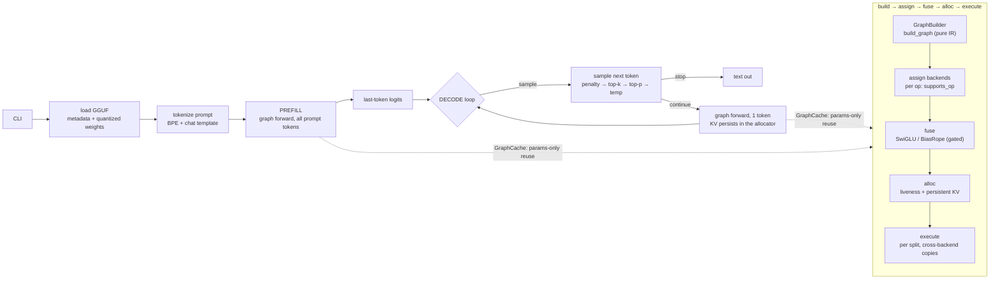

# minfer

A minimal local LLM inference engine built from scratch in Rust.

## Features

- **Declarative compute graph** — inference builds a `ComputeGraph` (pure IR)
  then assigns backends, fuses ops, allocates and executes via a scheduler,
  modeled on llama.cpp's `ggml_cgraph` + backend scheduler; params-only graph
  reuse (decode steps skip reconstruction), per-op backend assignment,
  Graphviz DOT export (`--dump-graph`)
- **GGUF loader** — parses GGUF v3 files (metadata + quantized tensors), split
  multi-part support, **mmap'd weights shared zero-copy with the GPU**
- **Self-contained BPE tokenizer** — loaded directly from GGUF metadata,
  no external dependency on tiktoken
- **CPU: AVX2-accelerated** — Q4₀×Q8₀ and Q8₀×Q8₀ dot products via AVX2+FMA
- **GPU: Metal backend** — Apple Silicon acceleration with flash attention
  (single fused kernel for decode + prefill, llama.cpp ports), simdgroup GEMM
  prefill for every quant type, SIMD-parallel RMSNorm, float4 vectorized
  kernels, a build-time precompiled `.metallib` (no per-run shader compile),
  and auto-selected f16 KV cache for 7B-class models
- **GPU: CUDA backend** (feature-gated `--features cuda`) — NVIDIA GPU
  acceleration with CUDA Graph capture/replay; **graph integration pending
  (Phase 7)** — the legacy `layer_gpu` path remains until then
- **Qwen2 architecture** — GQA attention, SwiGLU FFN, RoPE (Neox style),
  RMSNorm
- **Model download** — auto-download from Hugging Face Hub or Ollama registry
- **No external ML framework** — pure Rust, only depends on `rand`, `regex`,
  `half`, `serde`, and `serde_json`

## Supported Quantization Formats

minfer supports GGUF v3 files with the following quantized weight types.
The CPU backend quantizes activations to Q8_0 on-the-fly; the Metal GPU
backend reads f32 activations directly for all weight types (Q4_0 included),
matching llama.cpp's Metal backend.

### Supported

| Type | Bits | Block | CPU | AVX2 | CUDA GPU | Metal GPU |
|------|------|-------|:---:|:----:|:--------:|:---------:|
| **Q4_0** | 4 | 18 B / 32 val | ✅ | ✅ | ✅ | ✅ |
| **Q4_1** | 4 | 20 B / 32 val | ✅ | ❌ | ✅ | ✅¹ |
| **Q4_K** | 4 | 144 B / 256 val | ✅ | ❌ | ✅ | ✅¹ |
| **Q5_0** | 5 | 22 B / 32 val | ✅ | ✅ | ✅ | ✅¹ |
| **Q5_1** | 5 | 24 B / 32 val | ✅ | ❌ | ❌ | ✅¹ |
| **Q5_K** | 5 | 176 B / 256 val | ✅ | ❌ | ❌ | ✅¹ |
| **Q6_K** | 6 | 210 B / 256 val | ✅ | ❌ | ✅ | ✅¹ |
| **Q8_0** | 8 | 34 B / 32 val | ✅ | ✅ | ✅ | ✅¹ |
| **F32** | 32 | 4 B / 1 val | ✅ | — | ✅² | ✅² |

¹ Metal prefill uses a simdgroup GEMM for every quant type (dispatched when
`nt ≥ 2 && (od ≥ 2048 || nt ≥ 9)`); the scalar f32 multi kernels handle decode
(nt==1) and tiny small-od batches. The compute-graph `MetalBackend` dispatches
these kernels **per op** (`quant_matmul_f32_on_gpu_buf`), so every quant type
above runs on the GPU.
² F32 weights (RMSNorm, biases) are supported on GPU but not for matmul.

**GPU grouping note**: the old whole-layer `layer_gpu` path required all 7
weight matrices in a layer to share one quant group (all-Q4 or all-QK) and fell
back to CPU otherwise. The compute-graph path (default) has **no such
restriction** — backend assignment is per op, so mixed-group layers run fully
on the GPU. Q5_1/Q5_K use the Metal f32 path; `Raw` weights are not supported
on GPU and select the CPU backend for those ops.

### Not Yet Supported

| Category | Types |
|----------|-------|
| K-quants | Q2_K, Q3_K, Q8_K |
| I-quants | IQ1_S, IQ1_M, IQ2_XXS, IQ2_XS, IQ2_S, IQ3_XXS, IQ3_S, IQ4_NL, IQ4_XS |
| Other | Q1_0, BF16, TQ1_0, TQ2_0, MXFP4, NVFP4 |

Q5_K and Q5_1 are **fully supported on CPU and Metal GPU** — Q5_K_M models run
at full GPU speed. See `AGENTS.md` for the Q5_K formula + qh-indexing fixes.

## Supported Model Architectures

minfer currently supports **one** model architecture.

| Architecture | Variants | Status | Detection Key |
|-------------|----------|:------:|---------------|
| **Qwen2** | Qwen2, Qwen2.5 | ✅ Fully supported | `general.architecture = "qwen2"` |

### How Architecture Detection Works

minfer reads the `general.architecture` string from the GGUF metadata header.
Only the exact value `"qwen2"` (case-sensitive) is accepted. Any other value
produces a clear error:

```
Unsupported architecture: 'llama'
```

The loader will **not** silently misinterpret a non-Qwen2 model — it fails
immediately with a descriptive message. All model-agnostic components (BPE
tokenizer, Jinja2 chat template renderer, samplers) are ready for additional
architectures once the graph construction (`build_graph`) is added.

### Hyperparameter Keys

The Qwen2 loader reads GGUF keys from both `qwen2.*` and `llama.*` prefixes.
The `llama.*` fallback exists for compatibility with older GGUF converters that
used the `llama.` prefix as a de-facto standard for Llama-family hyperparameters.
This does **not** mean Llama architecture is supported.

### Adding a New Architecture

See `AGENTS.md` for a step-by-step guide. In brief:
1. Create `src/models/<name>/` with `mod.rs`, `graph.rs`, `loader.rs`
2. Add a `match` branch in `src/models/mod.rs::load_model()`
3. Define `HParams`, `LayerWeights`, and implement the `ModelDef` trait
   (including `build_graph(&self, params) -> ComputeGraph`, which is
   deterministic in params — the graph-reuse invariant)

Architectures that share Qwen2's tensor naming convention (LLaMA, Mistral, Phi)
should be relatively straightforward to port.

## Architecture

minfer is a pure-Rust LLM inference engine with no ML framework dependency.
The full design (module map, compute-graph pipeline, backend layering,
quantization layout, KV cache, adding a new architecture / backend) is
documented in **[`docs/ARCHITECTURE.md`](docs/ARCHITECTURE.md)**.

At a glance: a GGUF v3 model is loaded and dispatched on `general.architecture`
to an implementation of the `ModelDef` trait; every forward call **builds a
declarative compute graph** (`ComputeGraph`), then the scheduler assigns
backends per op (Metal before CPU), applies pattern-based fusion, allocates
buffers with liveness analysis, and executes in per-backend splits:



Key invariants: **KV positions are data** (the graph topology never depends on
`n_past`, so decode steps reuse one graph); each layer owns **two persistent KV
regions** (K and V) resolved via `kv_pair(layer)`; in-place ops (`Silu`/`RoPE`)
alias their input buffer; matmuls follow the GGUF weight layout
(`od = shape[1]`, `id = shape[0]`).

Key modules: `src/graph/` (IR / builder / scheduler / backends / reuse cache),
`gguf.rs` (parser + mmap'd zero-copy loader), `models/qwen2/` (build_graph +
loader), `kernel.rs`/`avx2.rs` (quantized matmul), `metal.rs`+`metal.metal` and
`cuda.rs`+`cuda_kernels.cu` (GPU kernels), `sampler.rs`/`tokenizer.rs`/
`template.rs` (sampling + tokenization + chat templates). Supported quants:
Q4_0, Q4_1, Q8_0, Q4_K, Q6_K, Q5_0, Q5_1, Q5_K (CPU + Metal), F32/F16 norms &
biases.

## Usage

```bash
cargo run --release -- <model> [prompt] [OPTIONS]
```

`<model>` can be a local path, a download URI, or a cached model name:

| Format | Example |
|--------|---------|
| Local file | `~/models/qwen2.gguf`, `./model.gguf`, `/abs/model.gguf` |
| Hugging Face | `hf:Qwen/Qwen2-0.5B-GGUF:qwen2-0.5b-q4_0.gguf` (auto-download) |
| Ollama | `ollama:qwen2.5:0.5b` (pull) |
| Cached model name | `qwen2.5-0.5b-instruct-q4_0` (resolved from `~/.cache/minfer/models`, see `list`) |

If `prompt` is omitted, reads from stdin. Run `minfer --help` for full options
(`--meta`, `--no-template`, `--dump-graph <path>` to export the prefill compute
graph as Graphviz DOT).

**Examples:**

```bash
# Local model
cargo run --release -- ~/models/qwen2-0.5b-q4_0.gguf "What is the capital of France?"

# Cached model by name (no full path needed)
cargo run --release -- qwen2.5-0.5b-instruct-q4_0 "Hello"

# Auto-download from Hugging Face + run
cargo run --release -- hf:Qwen/Qwen2.5-0.5B-Instruct-GGUF:qwen2.5-0.5b-instruct-q4_0.gguf "Hello"

# List available GGUF files in a HF repo (without downloading)
cargo run --release -- download hf Qwen/Qwen2.5-0.5B-Instruct-GGUF

# Pull from Ollama and create a symlink
cargo run --release -- download ollama qwen2.5:0.5b

# List locally cached models
cargo run --release -- list
```

## Performance

> The table below was measured on the **legacy `layer_gpu` path** (pre-compute-
> graph). Since Phase 6 the compute-graph path is the default, and since
> G1–G5 (2026-08-21) its `MetalBackend` wires the same fast kernels (flash/
> split/parallel attention dispatch + `rms_norm_256` + the `n_out` tail-row
> reduction + **fused decode QKV + FFN gate/up**), so graph-path numbers now
> **match or exceed the legacy path**: 0.5B Q4_0 decode ~300-330 t/s at KV440
> (**+~15 % over legacy** — G4 fuses the QKV chain into one concat matmul +
> one bias+rope+store pass, G5 fuses the FFN gate/up the same way), 0.5B
> prefill ~3900–4000 t/s at pp440 (**+~55 % over legacy** — the G3 tail
> reduction drops the full-nt last-layer FFN + lm_head), 7B decode ~46-49 t/s
> (≈ legacy; FFN fusion gated off there — Q4_K concat matmul slower).
> Remaining gap: 7B prefill ~−10 % (GEMM-bound; attention is not the
> bottleneck there). Greedy outputs are byte-identical across all graph paths
> (`MINFER_NO_FUSE_QKV` / `MINFER_NO_FUSE_FFN` revert the decode fusions).
> See [`docs/METAL_OPTIMIZATIONS.md`](docs/METAL_OPTIMIZATIONS.md) §0.1/§4.3.

**Qwen2 / Qwen2.5 on Apple M4 Pro / RTX 2080 Ti (2026-08-21):**

| Backend | Hardware | Model | Prefill (pp499) | Decode (greedy) |
|---------|----------|-------|---------|--------|
| CPU (AVX2) | i7-1260P | Qwen2-0.5B | ~27 tok/s | ~21 tok/s |
| CUDA + Graph | RTX 2080 Ti | Qwen2.5-0.5B | ~593 tok/s | ~486 tok/s |
| Metal GPU | Apple M4 Pro | Qwen2.5-0.5B Q4_K_M | ~4460 tok/s | ~268 tok/s |
| Metal GPU | Apple M4 Pro | Qwen2.5-0.5B Q4_0 | ~4775 tok/s | ~321 tok/s |
| Metal GPU | Apple M4 Pro | Qwen2.5-1.5B Q4_K_M | ~1750 tok/s | ~153 tok/s |
| Metal GPU | Apple M4 Pro | Qwen2.5-7B Q4_K_M | ~430 tok/s (pp31 ~250) | ~48 tok/s |

Prefill uses simdgroup GEMMs for every quant type (dispatched for
`nt ≥ 2 && (od ≥ 2048 || nt ≥ 9)`); decode uses fused QKV/FFN matmuls + a
KV-parallel split attention. See
**[`docs/METAL_OPTIMIZATIONS.md`](docs/METAL_OPTIMIZATIONS.md)**.

GPU decode optimizations: CUDA Graph capture/replay (single `cudaGraphLaunch`
per decode step), full-layer GPU offload with zero-copy buffers, on-GPU
activation quantization (f32 → Q8_0). Metal: flash attention (online softmax,
fused decode + prefill kernels), SIMD-parallel RMSNorm with float4
vectorization, fused QKV/FFN decode matmuls, f16 KV for 7B-class models.

## Project Structure

```
minfer/
├── Cargo.toml             # crate manifest (deps, [features] cuda / debug_dump)
├── Cargo.lock
├── build.rs               # CUDA kernels + Metal metallib (precompiled shaders)
├── flake.nix / flake.lock # Nix dev shell
├── pyproject.toml         # Python tooling for the verification scripts
├── AGENTS.md              # AI-agent project index (architecture, conventions)
├── LICENSE
├── README.md
├── src/
│   ├── main.rs            # Entry point, CLI, inference loop
│   ├── graph/             # ★ Declarative compute graph (the inference core)
│   │   ├── mod.rs         # ComputeGraph, CNode, DType, Backend, BufRef
│   │   ├── ops.rs         # Op enum + node metadata
│   │   ├── builder.rs     # GraphBuilder (declarative construction)
│   │   ├── alloc.rs       # Per-backend liveness allocator + persistent KV regions
│   │   ├── backend.rs     # Backend trait + KvProvider
│   │   ├── cpu_backend.rs # CPU execution
│   │   ├── metal_backend.rs # Metal (MPS) per-op execution
│   │   ├── scheduler.rs   # assign → split → execute (+ cross-backend copies)
│   │   ├── fusion.rs      # Pattern fusion (gated by supports_fused)
│   │   ├── cache.rs       # GraphCache — params-only graph reuse
│   │   ├── params.rs      # GraphParams (the reuse identity)
│   │   └── dot.rs         # Graphviz DOT export (--dump-graph)
│   ├── gguf.rs            # GGUF parser (v3) + mmap'd zero-copy loader
│   ├── block.rs           # Quantized block types + fp16 conversions
│   ├── avx2.rs            # AVX2 dot product kernels + quantization
│   ├── cuda.rs            # CUDA GPU state, FFI bindings, graph capture
│   ├── cuda_kernels.cu    # CUDA kernels (matmul, attention, element-wise ops)
│   ├── metal.rs           # Metal kernels + per-op dispatch (metallib, mmap weights)
│   ├── metal.metal        # Metal compute shaders (attention, matmul, norm)
│   ├── kernel.rs          # Quantized matmul dispatch (CPU/GPU bridge)
│   ├── tensor.rs          # Tensor struct + data access
│   ├── vec_ops.rs         # SIMD vector ops (RMSNorm, RoPE, softmax, SiLU)
│   ├── cache.rs           # Legacy KV cache type (CLI plumbing; the graph owns KV)
│   ├── dump.rs            # Debug dump module (gated by `--features debug_dump`)
│   ├── sampler.rs         # Greedy / temperature / top-k / top-p sampling
│   ├── tokenizer.rs       # BPE tokenizer (self-contained, GGUF-backed)
│   ├── template.rs        # Chat template detection + formatting
│   ├── download/          # Model download from HF Hub & Ollama
│   │   └── mod.rs         # resolve() URI handler, curl-based HTTP, list_local()
│   └── models/            # Architecture-specific implementations
│       ├── mod.rs         # ModelDef trait + load_model factory dispatch
│       └── qwen2/         # Qwen2 implementation
│           ├── mod.rs     # Qwen2Model + ModelDef impl
│           ├── graph.rs   # build_graph + graph forward (Qwen2Graph)
│           └── loader.rs  # Tensor loading from GGUF
├── tests/                 # Kernel isolation tests (vs CPU reference)
│   ├── flash_attn_blk_isolation.rs
│   ├── flash_attn_isolation.rs
│   ├── gemm_isolation.rs
│   └── gqa_attn_isolation.rs
├── scripts/               # Benchmark + verification tooling
│   ├── bench.sh           # GPU benchmark wrapper (asserts MPS active)
│   ├── compare_layers.py  # Layer-by-layer comparison vs llama.cpp dumps
│   ├── dump_llama_ref.py  # llama.cpp reference dump generator
│   ├── dump_tensors.py
│   ├── export_trace.sh
│   ├── lib.py
│   └── verify_*.py        # Per-op verifiers (rmsnorm, rope, attention, ...)
└── experiments/           # Throwaway experiments
    └── cuda/              # CUDA graph capture prototypes
```

## License

MIT
