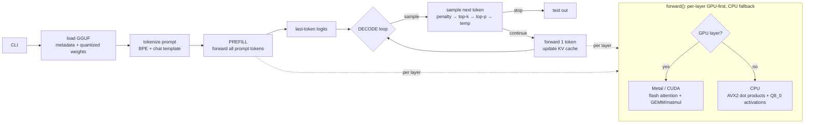

# minfer

A minimal local LLM inference engine built from scratch in Rust.

## Features

- **GGUF loader** — parses GGUF v3 files (metadata + quantized tensors)
- **Self-contained BPE tokenizer** — loaded directly from GGUF metadata,
  no external dependency on tiktoken
- **CPU: AVX2-accelerated** — Q4₀×Q8₀ and Q8₀×Q8₀ dot products via AVX2+FMA
- **GPU: CUDA backend** — NVIDIA GPU acceleration with CUDA Graph capture/replay
  for decode, full-layer GPU offload (zero-copy), automatic best-GPU selection
 - **GPU: Metal backend** — Apple Silicon acceleration with flash attention
   (online softmax), a **KV-parallel split attention** for decode (partial +
   combine passes, ~2× decode over the single-pass kernel), SIMD-parallel
   RMSNorm, float4 vectorized kernels
- **Qwen2 architecture** — GQA attention, SwiGLU FFN, RoPE (Neox style),
  RMSNorm
- **Model download** — auto-download from Hugging Face Hub or Ollama registry
- **No external ML framework** — pure Rust, only depends on `rand`, `regex`,
  `half`, `serde`, and `serde_json`

## Supported Quantization Formats

minfer supports GGUF v3 files with the following quantized weight types.
The CPU backend quantizes activations to Q8_0 on-the-fly; the Metal GPU
backend reads f32 activations directly for all weight types (Q4_0 included),
matching llama.cpp's Metal backend.

### Supported

| Type | Bits | Block | CPU | AVX2 | CUDA GPU | Metal GPU |
|------|------|-------|:---:|:----:|:--------:|:---------:|
| **Q4_0** | 4 | 18 B / 32 val | ✅ | ✅ | ✅ | ✅ |
| **Q4_1** | 4 | 20 B / 32 val | ✅ | ❌ | ✅ | ✅¹ |
| **Q4_K** | 4 | 144 B / 256 val | ✅ | ❌ | ✅ | ✅¹ |
| **Q5_0** | 5 | 22 B / 32 val | ✅ | ✅ | ✅ | ✅¹ |
| **Q5_1** | 5 | 24 B / 32 val | ✅ | ❌ | ❌ | ✅¹ |
| **Q5_K** | 5 | 176 B / 256 val | ✅ | ❌ | ❌ | ✅¹ |
| **Q6_K** | 6 | 210 B / 256 val | ✅ | ❌ | ✅ | ✅¹ |
| **Q8_0** | 8 | 34 B / 32 val | ✅ | ✅ | ✅ | ✅¹ |
| **F32** | 32 | 4 B / 1 val | ✅ | — | ✅² | ✅² |

¹ Metal prefill uses a simdgroup GEMM for every quant type (nt≥16); the scalar
f32 multi kernels handle decode (nt==1) and small prefills. Q4_0/Q4_1/Q4_K/
Q5_0/Q5_1/Q5_K/Q6_K/Q8_0 all run through `layer_gpu` (full-layer offload).
² F32 weights (RMSNorm, biases) are supported on GPU but not for matmul.

**GPU grouping restriction** (CUDA and Metal): within one transformer layer,
all 7 weight matrices (WQ, WK, WV, WO, FFN Gate, FFN Up, FFN Down) must be
either **all in the Q4 group** (Q4_0 / Q4_1) or **all in the QK group**
(Q4_K / Q5_0 / Q6_K). Mixed groups within a layer are rejected and fall back
to CPU. Q5_1 / Q5_K (Metal f32 path) are exempt from this grouping. Layers with
any unsupported weight type (e.g. `Raw`) fall back to CPU per-layer.

### Not Yet Supported

| Category | Types |
|----------|-------|
| K-quants | Q2_K, Q3_K, Q8_K |
| I-quants | IQ1_S, IQ1_M, IQ2_XXS, IQ2_XS, IQ2_S, IQ3_XXS, IQ3_S, IQ4_NL, IQ4_XS |
| Other | Q1_0, BF16, TQ1_0, TQ2_0, MXFP4, NVFP4 |

Q5_K and Q5_1 are **fully supported on CPU and Metal GPU** — Q5_K_M models run
at full GPU speed. See `AGENTS.md` for the Q5_K formula + qh-indexing fixes.

## Supported Model Architectures

minfer currently supports **one** model architecture.

| Architecture | Variants | Status | Detection Key |
|-------------|----------|:------:|---------------|
| **Qwen2** | Qwen2, Qwen2.5 | ✅ Fully supported | `general.architecture = "qwen2"` |

### How Architecture Detection Works

minfer reads the `general.architecture` string from the GGUF metadata header.
Only the exact value `"qwen2"` (case-sensitive) is accepted. Any other value
produces a clear error:

```
Unsupported architecture: 'llama'
```

The loader will **not** silently misinterpret a non-Qwen2 model — it fails
immediately with a descriptive message. All model-agnostic components (BPE
tokenizer, Jinja2 chat template renderer, samplers) are ready for additional
architectures once the forward-pass code is added.

### Hyperparameter Keys

The Qwen2 loader reads GGUF keys from both `qwen2.*` and `llama.*` prefixes.
The `llama.*` fallback exists for compatibility with older GGUF converters that
used the `llama.` prefix as a de-facto standard for Llama-family hyperparameters.
This does **not** mean Llama architecture is supported.

### Adding a New Architecture

See `AGENTS.md` for a step-by-step guide. In brief:
1. Create `src/models/<name>/` with `mod.rs`, `forward.rs`, `loader.rs`
2. Add a `match` branch in `src/models/mod.rs::load_model()`
3. Define `HParams`, `LayerWeights`, and implement the `ModelDef` trait

Architectures that share Qwen2's tensor naming convention (LLaMA, Mistral, Phi)
should be relatively straightforward to port.

## Architecture

minfer is a pure-Rust LLM inference engine with no ML framework dependency.
The full design (module map, inference pipeline, backend layering & fallback,
quantization layout, KV cache, adding a new architecture) is documented in
**[`docs/ARCHITECTURE.md`](docs/ARCHITECTURE.md)**.

At a glance: a GGUF v3 model is loaded and dispatched on `general.architecture`
to an implementation of the `ModelDef` trait; every forward call is an
imperative per-layer loop that tries the GPU first (Metal on Apple Silicon,
CUDA on NVIDIA) and falls back to the CPU per-layer:



Key modules: `gguf.rs` (parser), `models/qwen2/` (forward pass + loader),
`kernel.rs`/`avx2.rs` (quantized matmul), `metal.rs`+`metal.metal` and
`cuda.rs`+`cuda_kernels.cu` (GPU backends), `cache.rs` (KV cache),
`sampler.rs`/`tokenizer.rs`/`template.rs` (sampling + tokenization + chat
templates). Supported quants: Q4_0, Q4_1, Q8_0, Q4_K, Q6_K, Q5_0, Q5_1, Q5_K
(CPU + Metal), F32/F16 norms & biases.

## Usage

```bash
cargo run --release -- <model> [prompt] [OPTIONS]
```

`<model>` can be a local path, a download URI, or a cached model name:

| Format | Example |
|--------|---------|
| Local file | `~/models/qwen2.gguf`, `./model.gguf`, `/abs/model.gguf` |
| Hugging Face | `hf:Qwen/Qwen2-0.5B-GGUF:qwen2-0.5b-q4_0.gguf` (auto-download) |
| Ollama | `ollama:qwen2.5:0.5b` (pull) |
| Cached model name | `qwen2.5-0.5b-instruct-q4_0` (resolved from `~/.cache/minfer/models`, see `list`) |

If `prompt` is omitted, reads from stdin. Run `minfer --help` for full options
(`--meta`, `--no-template`).

**Examples:**

```bash
# Local model
cargo run --release -- ~/models/qwen2-0.5b-q4_0.gguf "What is the capital of France?"

# Cached model by name (no full path needed)
cargo run --release -- qwen2.5-0.5b-instruct-q4_0 "Hello"

# Auto-download from Hugging Face + run
cargo run --release -- hf:Qwen/Qwen2.5-0.5B-Instruct-GGUF:qwen2.5-0.5b-instruct-q4_0.gguf "Hello"

# List available GGUF files in a HF repo (without downloading)
cargo run --release -- download hf Qwen/Qwen2.5-0.5B-Instruct-GGUF

# Pull from Ollama and create a symlink
cargo run --release -- download ollama qwen2.5:0.5b

# List locally cached models
cargo run --release -- list
```

## Performance

**Qwen2 / Qwen2.5 — 0.5B class (Q4_0, ~400 MB):**

| Backend | Hardware | Model | Prefill | Decode |
|---------|----------|-------|---------|--------|
| CPU (AVX2) | i7-1260P | Qwen2-0.5B | ~27 tok/s | ~21 tok/s |
| CUDA + Graph | RTX 2080 Ti | Qwen2.5-0.5B | ~593 tok/s | ~486 tok/s |
| Metal GPU | Apple M4 Pro | Qwen2.5-0.5B Q4_K_M | ~650–1000 tok/s | ~230 tok/s |
| Metal GPU | Apple M4 Pro | Qwen2.5-0.5B Q4_0 | ~966 tok/s | ~315 tok/s |
| Metal GPU | Apple M4 Pro | Qwen2.5-1.5B Q4_K_M | ~650–770 tok/s | ~155–160 tok/s |
| Metal GPU | Apple M4 Pro | Qwen2.5-7B Q4_K_M | ~120–130 tok/s | ~42–45 tok/s |

Prefill uses simdgroup GEMMs for every quant type (Q4_0/Q4_1/Q5_0/Q5_1/Q8_0/
Q4_K/Q5_K/Q6_K); decode uses fused QKV/FFN matmuls + a KV-parallel split
attention. See **[`docs/METAL_OPTIMIZATIONS.md`](docs/METAL_OPTIMIZATIONS.md)**.

GPU decode optimizations: CUDA Graph capture/replay (single `cudaGraphLaunch`
per decode step), full-layer GPU offload with zero-copy buffers, on-GPU
activation quantization (f32 → Q8_0). Metal: flash attention (online softmax),
SIMD-parallel RMSNorm with float4 vectorization, Q4_0 × Q8_0 matmul.

## Architecture

```
src/
├── main.rs          # Entry point, CLI, inference loop
├── gguf.rs          # GGUF format parser (v3) + KV helpers
├── block.rs         # Quantized block types + fp16 conversions
├── avx2.rs          # AVX2 dot product kernels + quantization
├── cuda.rs          # CUDA GPU state, FFI bindings, graph capture
├── cuda_kernels.cu  # CUDA kernels (matmul, attention, element-wise ops)
├── metal.rs         # Metal GPU state machine + kernel dispatch
├── metal.metal      # Metal compute shaders (attention, matmul, norm)
├── build.rs         # CUDA kernel compilation + arch detection
├── kernel.rs        # Quantized matmul dispatch (CPU/GPU bridge)
├── tensor.rs        # Tensor struct + data access
├── vec_ops.rs       # SIMD vector ops (RMSNorm, RoPE, softmax, SiLU)
├── cache.rs         # KV cache (shared, architecture-agnostic)
├── dump.rs          # Debug dump module (gated by `--features debug_dump`)
├── sampler.rs       # Greedy / temperature / top-k / top-p sampling
├── tokenizer.rs     # BPE tokenizer (self-contained, GGUF-backed)
├── template.rs      # Chat template detection + formatting
├── download/        # Model download from HF Hub & Ollama
│   └── mod.rs       # resolve() URI handler, curl-based HTTP, list_local()
└── models/          # Architecture-specific implementations
    ├── mod.rs       # ModelDef trait + load_model factory dispatch
    └── qwen2/       # Qwen2 implementation
        ├── mod.rs       # Qwen2Model + ModelDef impl
        ├── forward.rs   # Forward pass (CPU + GPU paths)
        └── loader.rs    # Tensor loading from GGUF
```

## License

MIT
