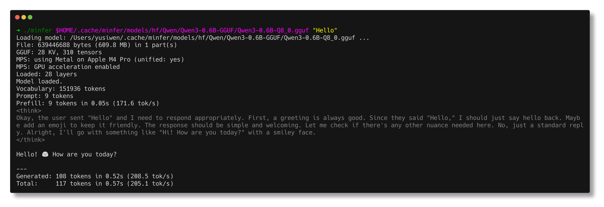
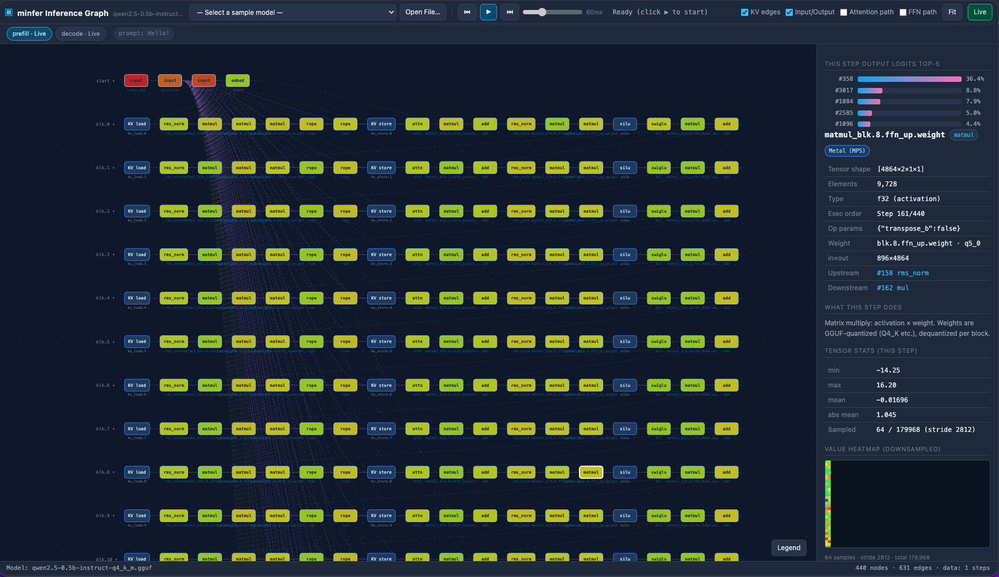
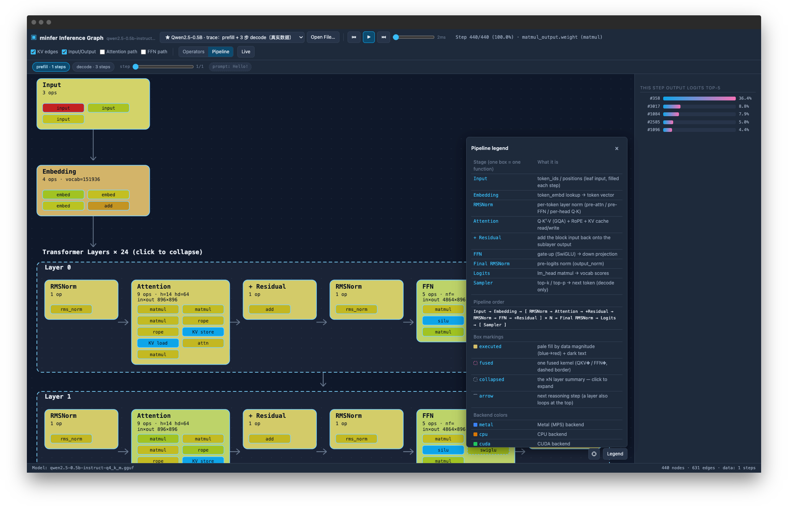
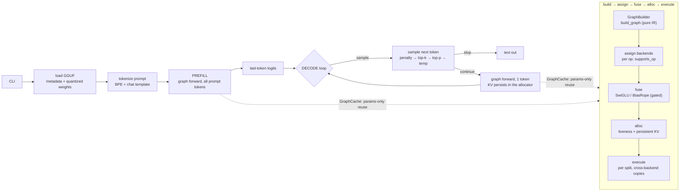

# minfer

A minimal local LLM inference engine built from scratch in Rust.

<p align="center">

[](#)
[](#)
[](#)
[](#)
[](#)
[](#)
[](#)
[](#)

</p>

**📚 Documentation** — the full project docs site (architecture, compute graph, backends, tooling): [yusiwen.cn/minfer](https://yusiwen.cn/minfer/)



## Features

> Full detail: [docs/FEATURES.md](docs/FEATURES.md) — also on the [docs site](https://yusiwen.cn/minfer/FEATURES.html)

- **Declarative compute graph** — pure-IR graph + scheduler (llama.cpp-inspired), params-only reuse, DOT export
- **Interactive graph visualization** — `minfer viz <model>`: live SSE inference, per-node stats/heatmaps in the browser
- **GGUF v3 loader** — split multi-part, mmap'd weights shared zero-copy with the GPU
- **Self-contained BPE tokenizer** — from GGUF metadata, no tiktoken; special-token templates match llama.cpp exactly
- **CPU: AVX2 / NEON+SDOT** — all 8 quant dots SIMD'd + persistent thread pool
- **GPU: Metal** — fused flash attention, simdgroup GEMM, precompiled `.metallib`, f16 KV cache
- **GPU: CUDA** — default-on int8 tensor-core MMQ path: **~3581 tok/s @7B q4_K_m prefill = 1.080× llama.cpp**; CUDA Graph capture, flash attention, memory/speed opt-out gates
- **Qwen2 / Qwen3** — GQA, SwiGLU, RoPE, RMSNorm; Qwen3 decoupled head dim + per-head Q/K norm
- **Model download** — Hugging Face Hub / Ollama, resumable
- **Multi-turn conversation CLI** (`--cnv`) — incremental prefill, session persistence
- **OpenAI-compatible server** (`serve`) — `/v1/chat/completions` streaming, multi-slot
- **No ML framework** — pure Rust, minimal runtime deps, all kernels handwritten

> Supported quantization formats & model architectures:
> [docs/SUPPORT-MATRIX.md](docs/SUPPORT-MATRIX.md) — also on the
> [docs site](https://yusiwen.cn/minfer/SUPPORT-MATRIX.html)

## Interactive Web Visualization (viz/)

The inference compute graph can be viewed interactively in the browser. A toolbar switch
offers **two views of the same graph**:

- **Operators** — the layered tensor grid: one node = one operator, one edge = a tensor data
  flow. Nodes are colored by backend + data magnitude, with per-node tensor stats, heatmaps,
  and logits top-5.
- **Pipeline** — a semantic reasoning pipeline: one box = one function/stage
  (`Input → Embedding → [layer loop: RMSNorm → Attention → +Residual → RMSNorm → FFN → +Residual]`
  `→ Final RMSNorm → Logits → [Sampler]`), with collapsible layers, a `← Back` drill-down
  inspector, and a context-aware legend. Stages are derived from the exported graph (op + weight
  name), so it needs no extra instrumentation and works on the same structure/trace/live data.

Both views support playback animation and live inference over SSE:




- **Live streaming**: `minfer viz <model.gguf>` (default port 8081; `--port N` to
  change) serves the page + live SSE from a single process.
- **Export a graph**: `minfer --dump-graph-json graph.json <model> "Hello"`; or
  pick a canned sample via the page's "Select a sample model" dropdown.

See **[viz/README.md](viz/README.md)** for the full user guide, the JSON format,
and all page features.

## Architecture

minfer is a pure-Rust LLM inference engine with no ML framework dependency.
The full design (module map, compute-graph pipeline, backend layering,
quantization layout, KV cache, adding a new architecture / backend) is
documented in **[`docs/ARCHITECTURE.md`](docs/ARCHITECTURE.md)**.

At a glance: a GGUF v3 model is loaded and dispatched on `general.architecture`
to an implementation of the `ModelDef` trait; every forward call **builds a
declarative compute graph** (`ComputeGraph`), then the scheduler assigns
backends per op (Metal before CPU), applies pattern-based fusion, allocates
buffers with liveness analysis, and executes in per-backend splits:



Key invariants: **KV positions are data** (the graph topology never depends on
`n_past`, so decode steps reuse one graph); each layer owns **two persistent KV
regions** (K and V) resolved via `kv_pair(layer)`; in-place ops (`Silu`/`RoPE`)
alias their input buffer; matmuls follow the GGUF weight layout
(`od = shape[1]`, `id = shape[0]`).

Key modules: `src/graph/` (IR / builder / scheduler / backends / reuse cache),
`gguf.rs` (parser + mmap'd zero-copy loader), `models/qwen2/` (build_graph +
loader), `kernel.rs`/`quants.rs` (quantized matmul), `metal.rs`+`metal.metal` and
`cuda.rs`+`cuda_kernels.cu` (GPU kernels), `sampler.rs`/`tokenizer.rs`/
`template.rs` (sampling + tokenization + chat templates), `conversation.rs`
(multi-turn sessions), `server/` (HTTP). Supported quants:
Q4_0, Q4_1, Q8_0, Q4_K, Q6_K, Q5_0, Q5_1, Q5_K (CPU + Metal), F32/F16 norms &
biases.

## Performance

**CUDA — NVIDIA GB10 (DGX Spark, sm_121), default path (2026-09-06):**

| Model | Prefill (pp3314) | vs llama.cpp | Decode (tg128) | Device mem |
|-------|------------------|--------------|----------------|------------|
| Qwen2.5-7B-Instruct Q4_K_M | **~3581 tok/s** | **1.080×** (llama-bench 3323.3, same shape) | ~45 tok/s (parity) | ~9.5 GB |

The int8 tensor-core MMQ path is **default-on** in CUDA builds — ~3581 tok/s is
8.1× over the 441 tok/s where the path started, with every optimization step
(measurement, gates and commit) documented in the 75-step history table of
**[`docs/CUDA_OPTIMIZATION.md`](docs/CUDA_OPTIMIZATION.md)**.
`MINFER_MMQ=0` restores the legacy f16 path; `MINFER_MMQ_Q6K_EXP=0` /
`MINFER_MMQ_Q4K_DSC=0` trade ~6% prefill for ~3.3 GB of device memory.

**Metal — Apple M4 Pro (2026-08-21, compute-graph path):**

| Model | Prefill (pp499) | Decode (greedy) |
|-------|-----------------|-----------------|
| Qwen2.5-0.5B Q4_K_M | ~4460 tok/s | ~268 tok/s |
| Qwen2.5-0.5B Q4_0 | ~4775 tok/s | ~321 tok/s |
| Qwen2.5-1.5B Q4_K_M | ~1750 tok/s | ~153 tok/s |
| Qwen2.5-7B Q4_K_M | ~430 tok/s (pp31 ~250) | ~48 tok/s |

CPU (AVX2) reference: Qwen2-0.5B on i7-1260P ~27 tok/s prefill / ~21 tok/s
decode.

Metal prefill uses simdgroup GEMMs for every quant type (dispatched for
`nt ≥ 2 && (od ≥ 2048 || nt ≥ 9)`); decode uses fused QKV/FFN matmuls + a
KV-parallel split attention. See
**[`docs/METAL_OPTIMIZATIONS.md`](docs/METAL_OPTIMIZATIONS.md)**.

Decode optimizations on both GPU backends: CUDA Graph capture/replay (single
launch per decode step), full-layer GPU offload with zero-copy buffers,
on-GPU activation quantization (f32 → Q8_0), fused decode QKV/FFN chains,
flash attention with online softmax, and f16 KV cache for 7B-class models.

## Build

Requirements: **Rust** (edition 2021, no ML-framework dependencies — runtime
deps are minimal). A **Nix flake devShell** (`nix develop`) is available for a
batteries-included dev environment.

```bash
# CPU + Metal (macOS) — plain build, never touches nvcc
cargo build --release
./target/release/minfer <model.gguf> "hello"
```

On macOS the Metal backend is built in automatically: `build.rs` compiles
`src/metal.metal` → a precompiled `.metallib` via `/usr/bin/xcrun` at build
time (no per-run shader compile). If Xcode tools are unavailable the build
still succeeds and the shader is compiled from source at first run.

```bash
# CUDA (NVIDIA GPU) — opt-in feature, requires the CUDA toolkit (nvcc)
cargo build --release --features cuda
# statically-linked cudart (no libcudart.so runtime dep)
cargo build --release --features cuda,cuda_static
```

CUDA build details:

- nvcc is located via `PATH`, `CUDA_HOME`/`CUDA_PATH` (e.g. `/usr/local/cuda`);
  with `--features cuda` a missing toolkit is a **hard error** (with a clear
  message), and plain builds never touch nvcc at all.
- The host compiler is auto-detected: nvcc's default works when compatible;
  otherwise the first accepted GCC is pinned via `-ccbin` (e.g. a nix devShell
  putting GCC 15 first while CUDA 13 accepts ≤ GCC 13). Force one with
  `MINFER_CUDA_CCBIN=/path/to/g++`.
- GPU architectures are auto-detected from what the toolkit accepts (SASS for
  `sm_70`…`sm_121` as available, plus PTX for the highest and a backward-JIT
  `compute_70`/`compute_72` PTX) — one binary covers older and newer GPUs. The
  minimum is **sm_70 (Volta)**: the kernels in `cuda_kernels.cu` use WMMA tensor
  cores (`nvcuda::wmma`), which require sm_70+, so Pascal (sm_61) is not a
  target. The Volta V100/Titan-V (sm_70/72) PTX is only emitted when nvcc
  supports it: CUDA 12.x does, **CUDA 13 removed Volta**, so keep Volta coverage
  by building with CUDA 12.8 (the only version supporting Volta + the Blackwell
  RTX 50 sm_120/121, which needs ≥ 12.8).
- **cudart linking** (mirrors llama.cpp's `GGML_STATIC`): by default `-lcudart`
  is a shared link, so the binary NEEDEDs `libcudart.so.N` and needs the CUDA
  toolkit runtime present at runtime (an rpath to `<cuda_home>/lib64` is baked
  in). Adding `cuda_static` links `libcudart_static.a` instead: the binary has
  **no** `libcudart.so` NEEDED dependency and only needs the NVIDIA driver
  (`libcuda.so.1`, dlopen'd lazily at runtime) + libstdc++ — deployable without
  a CUDA toolkit. The driver is never a link-time dependency in either mode.
- In CUDA builds the int8 tensor-core MMQ prefill path is **default-on**
  (runtime gates `MINFER_MMQ*`, see [Performance](#performance) /
  [CUDA_OPTIMIZATION.md](docs/CUDA_OPTIMIZATION.md)).

```bash
# + per-node debug dumps (MINFER_DUMP_DIR)
cargo build --release --features debug_dump
```

## Usage

Examples use the built binary (`cargo build --release` first — see
[Build](#build)); `cargo run --release -- …` works identically.

```bash
./target/release/minfer <model> [prompt] [OPTIONS]
```

`<model>` can be a local path, a download URI, or a cached model name:

| Format | Example |
|--------|---------|
| Local file | `~/models/qwen2.gguf`, `./model.gguf`, `/abs/model.gguf` |
| Hugging Face | `hf:Qwen/Qwen2-0.5B-GGUF:qwen2-0.5b-q4_0.gguf` (auto-download) |
| Ollama | `ollama:qwen2.5:0.5b` (pull) |
| Cached model name | `qwen2.5-0.5b-instruct-q4_0` (resolved from `~/.cache/minfer/models`, see `list`) |

If `prompt` is omitted, reads from stdin. Run `minfer --help` for the full
option list; the subcommands are:

| Command | Purpose |
|---------|---------|
| `<model> [prompt] [OPTIONS]` | single-shot generation |
| `serve [--port N] [--n-ctx N] [--n-slots N] <model>` | OpenAI-compatible HTTP server |
| `info <model>` | print GGUF metadata + key tensors |
| `download hf <repo> [quant]` / `download ollama <model>[:tag]` | fetch models |
| `list` | list locally cached models |
| `viz [--port N] <model>` | self-contained viz server (default port 8081) |

Sampling options: `--temp` (default 0.8; `--greedy` = 0), `--top-k`/`--top-p`,
`--repeat-penalty` (+ `--frequency-penalty`/`--presence-penalty`), `--stop`
(repeatable), `-n/--n-predict`, `--seed`. `--n-ctx` sizes the KV cache (clamped
to the model's max context); `-t/--threads` sets CPU workers.

**Multi-turn conversation** (`--cnv`, docs/CLI-CONVERSATION-PLAN.md): append-only
KV + incremental template rendering — each turn only prefills the new message
delta, the whole conversation accumulates in the KV cache:

```bash
./target/release/minfer --cnv qwen2.5-0.5b-instruct-q4_0           # interactive REPL
./target/release/minfer --cnv -st qwen2.5-0.5b-instruct-q4_0 "hi"  # single turn
```

In-conversation commands: `/exit` `/quit`, `/clear`, `/regen` (regenerate the
last reply), `/help`; EOF (Ctrl+D) exits. Flags: `-st/--single-turn`,
`--system <STR>`, `-mli/--multiline-input`, `--color on|off|auto`,
`--session <FILE>` (save/load the conversation history as JSON; on overflow the
oldest turns are dropped automatically and generation continues). Qwen3-style
`<think>…</think>` reasoning blocks are gray-highlighted (single-shot mode too,
when stdout is a terminal or `MINFER_COLOR=1`).

**OpenAI-compatible HTTP server** (`serve`):

```bash
./target/release/minfer serve --n-ctx 4096 --n-slots 1 qwen2.5-0.5b-instruct-q4_0
# POST /v1/chat/completions  (stream + non-stream)
# GET  /v1/models, GET /health
```

**Examples:**

```bash
# Local model
./target/release/minfer ~/models/qwen2-0.5b-q4_0.gguf "What is the capital of France?"

# Cached model by name (no full path needed)
./target/release/minfer qwen2.5-0.5b-instruct-q4_0 "Hello"

# Auto-download from Hugging Face + run (quant auto-detected, splits included)
./target/release/minfer hf:Qwen/Qwen2.5-0.5B-Instruct-GGUF:qwen2.5-0.5b-instruct-q4_0.gguf "Hello"

# Inspect GGUF metadata + key tensors
./target/release/minfer info qwen2.5-0.5b-instruct-q4_0

# List available GGUF files in a HF repo (without downloading)
./target/release/minfer download hf Qwen/Qwen2.5-0.5B-Instruct-GGUF

# Pull from Ollama and create a symlink
./target/release/minfer download ollama qwen2.5:0.5b

# List locally cached models
./target/release/minfer list
```

## License

MIT
