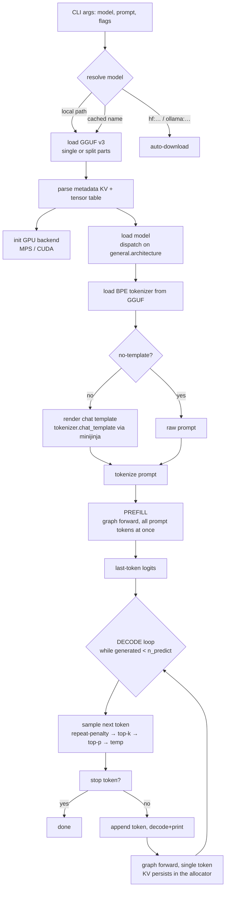
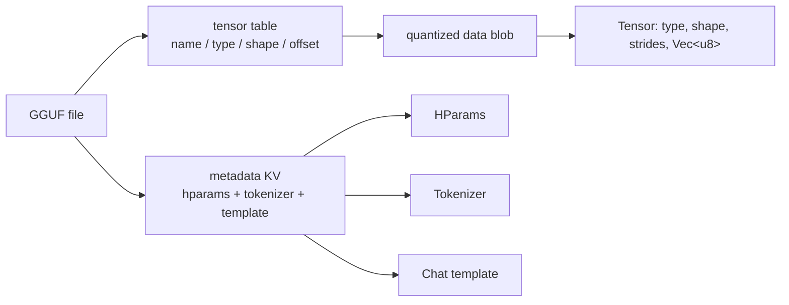
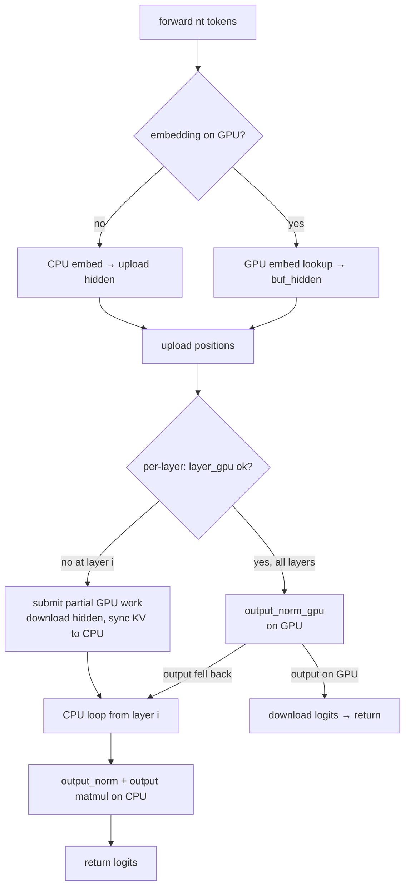

# minfer Architecture

> A pure-Rust LLM inference engine written from scratch, inspired by
> llama.cpp, with **zero ML framework dependencies**. Inference runs through a
> **declarative compute graph** (builder → scheduler → per-backend kernels),
> modeled on llama.cpp's `ggml_cgraph` + backend scheduler. This document
> describes the overall design: module responsibilities, the compute graph
> pipeline, the CPU / Metal backend layering, quantization, adding a new model
> architecture, and adding a new backend. The pre-graph imperative forward is
> preserved at the end as an appendix (Appendix A).

---

## 1. Design Principles

1. **No ML framework** — attention, RMSNorm, RoPE, SiLU, softmax are all
   handwritten. Only 5 external crates: `rand`, `regex`, `half`,
   `serde`/`serde_json`, `minijinja`.
2. **Declarative compute graph, not an imperative loop** — the forward pass is
   built as a pure `ComputeGraph` (no side effects at build time), then
   assigned to backends, fused, allocated, and executed by the scheduler. This
   mirrors llama.cpp (`ggml_cgraph` + `ggml_backend_sched`) and enables graph
   reuse, per-op backend assignment, DOT export, and a clean path to new
   backends. Design and implementation record: `docs/GRAPH-REFACTOR-PLAN.md`.
3. **Bytes-in / bytes-out tensors** — weight tensors are raw `&[u8]`; SIMD
   dot-product kernels (AVX2 / Metal shaders) operate on byte slices matching
   the exact GGML quantized block layout (`repr(C)` in `block.rs`).
4. **Activations stay f32** — CPU matmuls quantize activations to Q8_0
   on-the-fly; the Metal backend reads f32 activations directly for all weight
   types (matching llama.cpp's Metal backend).
5. **Backend assignment is a build-time decision, never a silent mid-execution
   fallback** — `supports_op` decides which ops run where; cross-backend
   transfers happen at split boundaries; kernel-invariant violations abort
   (`gpu_abort` / `Err`), they never silently fall back to CPU.

---

## 2. Module Map

| Module | Responsibility |
|---|---|
| `main.rs` | CLI, GGUF load, chat template, **prefill → autoregressive generation loop**, timing |
| `graph/` | **Compute graph core** — IR, builder, scheduler, backends, reuse cache (see §4 table) |
| `gguf.rs` | GGUF v3 parser (metadata KV + tensor table + data blob), multi-part (split) support, `ggml_pad` alignment |
| `block.rs` | 20+ quantized block types as `repr(C)` structs + fp16 conversions, matching `ggml-common.h` |
| `avx2.rs` | AVX2+FMA dot-product kernels (Q4_0×Q8_0, Q8_0×Q8_0) + f32→Q8_0 quantization, scalar fallback |
| `kernel.rs` | Quantized matmul dispatch (Q4_0/Q4_1/Q5_0/Q5_1/Q4_K/Q5_K/Q6_K/Q8_0) over activations, CPU scalar fallback, shared `embed_tokens` row getter |
| `vec_ops.rs` | SIMD vector ops: RMSNorm, RoPE (Qwen2/Llama styles), softmax, SiLU, add/scale/mul |
| `tensor.rs` | 4D `Tensor` (type/shape/strides/`Vec<u8>` data), ggml-compatible strides & byte sizing |
| `cache.rs` | **Legacy** per-layer KV cache type (the graph path owns KV in the allocator; kept for the CLI's `KVCache` plumbing) |
| `sampler.rs` | Repeat-penalty → top-k → top-p → temperature, seeded `StdRng` |
| `tokenizer.rs` | Self-contained BPE tokenizer, loaded from GGUF metadata (no tiktoken) |
| `template.rs` | ChatML / Llama3 / Mistral chat template rendering (minijinja) |
| `models/` | Architecture implementations. `mod.rs` has the `ModelDef` trait + factory dispatch |
| `models/qwen2/` | Qwen2/Qwen2.5: `mod.rs` (model struct + trait impl), `graph.rs` (`Qwen2Graph::build`/`forward`), `loader.rs` (GGUF weights + hparams) |
| `metal.rs` + `metal.metal` | Apple MPS (Metal) backend: per-op kernels + command-buffer encoding (the legacy whole-layer `layer_gpu` is retained for tests) |
| `cuda.rs` + `cuda_kernels.cu` | NVIDIA CUDA backend (feature-gated `--features cuda`): kernels + CUDA Graph capture; graph integration pending (Phase 7) |
| `download/` | Hugging Face Hub + Ollama download, cached-name resolution, resume support |
| `dump.rs` | Per-layer hidden-state debug dump (gated by `--features debug_dump`) |

### src/graph/ — the compute graph core

| File | Role |
|------|------|
| `mod.rs` | `ComputeGraph` (topo-validated node list + inputs/outputs), `CNode`, `DType`, `Backend`, `BufRef` |
| `ops.rs` | `Op` enum (full payload `PartialEq`), `NodeMeta`, `AttnMode`, `FusedOp` |
| `builder.rs` | `GraphBuilder` — declarative construction (embedding/rms_norm/matmul/rope/attn/kvcache/…) |
| `alloc.rs` | Per-backend liveness allocator + persistent per-layer KV regions + `KvProvider` |
| `backend.rs` | `Backend` trait + `KvProvider` |
| `cpu_backend.rs` | CPU execution (wraps kernel.rs + vec_ops.rs) |
| `metal_backend.rs` | Metal execution (per-op MPS kernels; `cfg(target_os = "macos")`) |
| `scheduler.rs` | assign → split → execute (+ cross-backend copies at split boundaries) |
| `fusion.rs` | Pattern-matching fusion (SwiGLU/BiasRope), gated by backend `supports_fused` |
| `cache.rs` | `GraphCache` — params-only deterministic graph reuse |
| `params.rs` | `GraphParams`/`CParams`/`GraphType` — the reuse identity |
| `dot.rs` | Graphviz DOT export (`--dump-graph`) |

---

## 3. Inference Pipeline

The top-level flow lives in `main.rs`. The whole engine is a **single-pass
prefill** followed by an **autoregressive decode loop**; both call
`ModelDef::forward`, which routes through the compute graph.



**Generation parameters** (defaults match llama.cpp): `temp=0.8`, `top_k=40`,
`top_p=0.95`, `repeat_penalty=1.1` (last 64 tokens), `seed=42`, `n_ctx=4096`,
`n_predict=512`.

Timing is dual-caliber: `Prefill:` = prompt tokens / prefill wall time;
`Generated:` = generated tokens / decode wall time (pure decode, matches
llama-bench "Generation" caliber); `Total:` = blended.

---

## 4. Compute Graph Architecture

Inference = **build a `ComputeGraph` (pure, side-effect free) → assign backends
→ fuse → allocate → execute**. The graph is built once per distinct
`GraphParams` and reused (decode steps reuse the same graph; the model's
`forward()` routes through `Qwen2Graph::forward`).

### 4.1 The IR

- `ComputeGraph` = topologically ordered `nodes` (builder appends sources
  before consumers), `inputs`, `outputs`, `uid` (for CUDA-Graph-style reuse).
- `CNode` = `op` + `src` dependencies + `out_shape`/`out_dtype` + `backend`
  (None until assigned) + `meta` (weight names, rope/attn params).
- `Op` carries **full payloads** (`RmsNorm{eps}`, `MatMul{transpose_b}`,
  `KvcacheStore{layer}` …) so graphs are structurally comparable.

### 4.2 Builder (`GraphBuilder`)

Per-architecture code calls builder methods (mirroring llama.cpp's
`llm_graph_context`): `embedding`, `rms_norm`, `matmul`, `rope`, `silu`, `add`,
`mul`, `swiglu`, `kvcache_store`/`kvcache_load`, `attn`. Building is pure —
no computation happens at build time.

### 4.3 Scheduler pipeline

```
assign_backends → fuse → alloc_graph → execute
```

1. **assign_backends** — capability-driven: each node gets the highest-priority
   backend whose `supports_op` returns true (Metal before CPU). Weight
   registration decides GPU feasibility.
2. **fuse** — pattern matching (`Mul(Silu(X),Y) → SwiGLU`, `RoPE(Add(X,B)) →
   FusedBiasRope`) gated per backend by `supports_fused` (no double-fusion with
   hand-written kernels). BatchMatMul is deferred (single-output IR limitation,
   plan §17.10).
3. **alloc_graph** — per-backend liveness allocator: buffers shared between
   nodes whose live ranges don't overlap; **persistent per-layer KV regions**
   survive rebuilds; in-place ops alias their input buffer (see §4.5).
4. **execute** — per split (contiguous same-backend runs): sync the previous
   backend, copy split inputs across backends (`copy_across`, a host round trip
   via shared memory), run the nodes, then a final sync. Metal batches one
   `MpsCommandBuffer` per split, submitted at `synchronize()`.

### 4.4 Reuse (`GraphCache`)

**Params-only deterministic reuse** (llama.cpp `allow_reuse` invariant):
`GraphParams` = `n_tokens` / `n_seqs` / `gtype` / `cparams` / `weights_version`
deterministically determines the topology — equal params ⇒ identical graph.
`n_past` is deliberately absent (it is execution data). `CParams.gpu` records
backend participation so a backend toggle forces a rebuild. `GraphCache` owns
the allocator (so the KV regions persist across rebuilds, e.g. the
prefill→decode transition) and `try_reuse` compares params only; debug builds
assert structural consistency (`Op: PartialEq`).

### 4.5 Core invariants (must not be violated)

1. **KV positions are data, not structure.** `KvcacheStore/Load` carry only the
   layer index; write positions come from the `positions` input node. Topology
   never depends on `n_past`.
2. **Each layer owns TWO persistent KV regions (K and V)**, resolved by
   `kv_pair(layer)` (`KvProvider`). The store node's output buffer is the K
   region; backends write the V sibling via `kv_pair`.
3. **GGUF weight layout**: metadata `[in, out]` (ne[0] fastest), memory
   `[out][in]` row-major → matmul `od = shape[1]`, `id = shape[0]`. Activations:
   shape metadata `[d, nt, 1, 1]`, memory token-major `[nt][d]`. I32 inputs are
   stored as `f32::from_bits` bit patterns (`fill_input_i32`).
4. **In-place ops (`Silu`, `RoPE`) alias their input buffer** — the allocator
   maps the output to the input's `BufRef` (only when the input's sole consumer
   is this op AND it is on the same backend). **Never host-copy a GPU-pending
   buffer**: a host `copy_in` of a producer that is encoded but not submitted
   reads stale data (the Phase-3 KV-corruption bug). Cross-backend in-place
   inputs get a fresh buffer (the producer completed before the split
   boundary, so the copy is safe there).
5. **Execution follows build order** (a valid topological order by
   construction) — guarantees a KV store executes before the attention that
   reads it. Nodes with no allocated buffer (dead, e.g. fusion orphans) are
   skipped.
6. **CPU vs Metal activation paths differ numerically**: CPU matmuls are
   Q8_0×Q8_0 (activation-quantized), Metal is Q8_0/Q4_0×f32. Compare Metal
   against manual quant×f32 references or layer-gpu-style math, not against the
   Q8_0-activation CPU path.

### 4.6 Per-layer computation (Qwen2) — as built by `graph.rs`

```mermaid
flowchart LR
    A["token_embd lookup (GetRows)"] --> B["hidden"]
    B --> C["RMSNorm attn_norm"]
    C --> D["WQ / WK / WV matmuls + bias"]
    D --> E["RoPE on Q and K (in-place alias)"]
    E --> F["kvcache_store: K/V → layer regions"]
    F --> G["GQA attention<br/>Q·K^T → softmax → ·V"]
    G --> H["WO matmul + bias"]
    H --> I["+ residual → hidden"]
    I --> J["RMSNorm ffn_norm"]
    J --> K["FFN gate + up matmuls"]
    K --> L["SiLU(gate) × up (fused SwiGLU)"]
    L --> M["FFN down matmul"]
    M --> N["+ residual → hidden"]
    N --> O["next layer / output_norm"]
```



GQA: each query head `h` maps to KV head `hk = h / gqa`. The KV head dimension
is independent (`n_kv_embd` read from the K weight's `ne[1]`), so Qwen2.5-0.5B
(n_embd=896, n_head=14, hd=64, n_kv_embd=128) strides correctly.

### 4.7 Prefill vs decode

| Phase | `nt` (tokens) | Notes |
|---|---|---|
| **Prefill** | > 1 | graph type `Prefill`; KV store writes all positions, attention reads the full written prefix |
| **Decode** | 1 | graph type `Decode`; **same topology** as prefill modulo `nt` → the graph is rebuilt once (KV persists), then reused for every subsequent token |

The graph path keeps K/V on the executing backend (attention and KV are on the
same backend by construction), so there is no per-token KV drain.

---

## 5. Backend Layering

### 5.1 The `Backend` trait (`graph/backend.rs`)

```rust
pub trait Backend: Send + Sync {
    fn name(&self) -> &str;
    fn supports_op(&self, op: &Op, dtype: DType) -> bool;
    fn supports_fused(&self, fused: &FusedOp) -> bool;
    fn alloc_buffer(&mut self, size: usize) -> usize;   // backend's own pool
    fn free_buffer(&mut self, id: usize);
    fn execute_node(&mut self, node: &CNode, in_bufs: &[usize],
                    out_buf: usize, kv_pair: Option<(usize, usize)>) -> Result<(), String>;
    fn read_host(&self, id: usize) -> Option<&[f32]>;
    fn write_host(&mut self, id: usize, data: &[f32]) -> Result<(), String>;
    fn synchronize(&mut self);
}
```

- **CPU** (`cpu_backend.rs`): `Vec<f32>` pool; executes via `kernel.rs` +
  `vec_ops.rs`; F32 weights use a plain f32 matmul, quantized weights use
  `cpu_quant_matmul_f32` (Q8_0-activation path).
- **Metal** (`metal_backend.rs`, macOS): shared-memory `MTLBuffer` pool; per-op
  dispatch to `MpsState`'s kernels (rms_norm, quant_matmul_f32_on_gpu_buf,
  rope, silu, add, mul, swiglu, embed_tokens_gpu, store_kv, gqa_attn_f32);
  one command buffer per split. Weights resolve by name from MpsState's
  registry (`weight_buf(name) -> (buffer, offset)`).
- **CUDA** (pending — Phase 7): wrap the existing `cuda.rs` (do NOT stub; keep
  CUDA Graph capture keyed on the graph `uid`), map `supports_op` from the
  existing capability matrix. See the plan §9/§17 and AGENTS.md "Adding a New
  Backend".

The **allocator owns every backend pool** (single source of truth); the
scheduler orchestrates assignment, cross-backend copies, and sync.

### 5.2 Selection rules

- **Metal**: all graph weights must be GPU-registered (`Qwen2Graph::weights_on_gpu`
  mirrors the old per-layer check). `MINFER_DISABLE_MPS=1` forces CPU.
- **CPU**: always available; AVX2 dispatch via
  `is_x86_feature_detected!("avx2")`, scalar fallback elsewhere.

### 5.3 GPU safety

All Metal submits wait bounded (10 s) and check status; no early return past a
`threadgroup_barrier`; device limits queried at runtime, never hardcoded; guard
failures `gpu_abort` with actual values. In the graph architecture,
**kernel-invariant violations return `Err` from `execute_node` and must NOT be
treated as a silent CPU fallback** — backend assignment at build time decides
where ops run; only genuine support limitations (e.g. Raw weights) select the
CPU backend. See `docs/GPU_SAFETY.md`.

---

## 6. Quantization & Tensor Layout

- **Weight layout** (`block.rs`): `repr(C)` blocks matching `ggml-common.h`.
  Q4_0/Q4_1/Q5_0/Q5_1/Q8_0 = 32-value blocks; Q4_K/Q5_K/Q6_K = 256-value
  super-blocks. Supported: Q4_0, Q4_1, Q8_0, Q4_K, Q6_K, Q5_0, Q5_1, Q5_K
  (CPU + Metal), F32/F16 norms & biases.
- **Activation quantization**: CPU matmuls quantize f32 activations to Q8_0
  on-the-fly (`avx2.rs`); Metal reads f32 directly.
- **GGUF parsing** (`gguf.rs`): `ggml_pad(x, n) = (x + n - 1) & !(n - 1)`
  alignment; tensor strides computed from type block size exactly like
  ggml; split multi-part models are merged into one tensor index.



---

## 7. KV Cache

The graph path owns the KV cache: **two persistent regions per layer (K and
V)**, sized `n_kv_embd × n_ctx`, allocated in the backend pool the layer runs
on. `kv_pair(layer)` resolves them; the KV store node writes K/V at the
positions carried by the `positions` input; attention reads the written prefix.
The regions live inside the `GraphCache`'s allocator and **survive graph
rebuilds** (the prefill→decode transition). `MINFER_CACHE_TYPE=f16` selects an
f16 GPU cache where the kernels support it. The legacy `cache.rs` `KVCache`
type remains only as CLI plumbing.

---

## 8. Adding a New Architecture

1. Create `src/models/<name>/` with `mod.rs`, `graph.rs`, `loader.rs`.
2. Add a `match` branch in `src/models/mod.rs::load_model()` for the new
   `general.architecture` value.
3. In `loader.rs`: define `HParams` (including `n_kv_embd`) and `LayerWeights`,
   parse them from GGUF metadata (both `qwen2.*` and `llama.*` prefixes are
   accepted).
4. In `graph.rs`: implement `build_graph(&self, params: &GraphParams) ->
   ComputeGraph` **deterministically in params** (the reuse invariant), using
   `GraphBuilder` — mirror llama.cpp's `llm_graph_context` builder methods.
5. In `mod.rs`: implement `ModelDef` (forward, build_graph, forward_graph,
   as_any, format_chat, special_tokens, dims, rope_style).
6. If needed, add a chat template format in `template.rs`.

Architectures that share Qwen2's tensor naming convention (LLaMA, Mistral,
Phi) are the easiest ports. The `RopeStyle` enum already covers Qwen2
(non-interleaved) and Llama (interleaved).

---

## 9. Model Download

`download/mod.rs` resolves `hf:<repo>[:<quant>]` and `ollama:<model>[:<tag>]`
URIs, downloads via curl with size-checked resume, quant-matches single or
split files case-insensitively, and stores them under
`~/.cache/minfer/models`. Cached filenames can be used directly as the model
argument.

---

## 10. Related Documentation

| Topic | Location |
|---|---|
| Compute graph design + rewrite plan + implementation record (per-phase commits) | `docs/GRAPH-REFACTOR-PLAN.md` |
| llama.cpp compute-graph design analysis (ggml_cgraph / scheduler / reuse) | `docs/LLAMA-COMPUTE-GRAPH.md` |
| Metal backend optimizations / gap analysis (primary tracking) | `docs/METAL_OPTIMIZATIONS.md` |
| GPU safety conventions + audit | `docs/GPU_SAFETY.md` |
| CPU backend optimizations | `docs/CPU_OPTIMIZATIONS.md` |
| CUDA backend roadmap / problems | `docs/CUDA_OPTIMIZATION.md`, `docs/CUDA_PROBLEMS.md` |
| Debug dump format | `docs/debug-dump.md` |
| Historical bugs / debugging notes | `docs/BUG-6-KV-CACHE-INDEXING.md`, `docs/QWEN2.5-*`, `docs/DEBUGGING-*` |

---

# Appendix A — Legacy Imperative Architecture (removed in Phase 6)

> Historical reference. The imperative per-layer forward (`models/qwen2/forward.rs`)
> was the engine's core until the compute graph replaced it (Phase 6); it is
> preserved here verbatim in structure so old notes, benchmarks, and kernel
> analyses remain interpretable. **Do not treat this as the current design.**

## A.1 Design stance (then)

The engine ran a direct per-layer forward loop instead of a compute graph:
"simpler, easier to trace, and the whole layer can be fused onto the GPU." The
GPU fallback was per-layer and safe: a layer that could not run on the GPU
(e.g. unsupported weight type) submitted partial GPU work, downloaded the
hidden state, and continued on the CPU.

## A.2 The old forward pass

`ModelDef::forward(tokens, positions, kv)` was implemented in
`models/qwen2/forward.rs` as an imperative loop:

```mermaid
flowchart LR
    A["token_embd lookup"] --> B["hidden"]
    B --> C["RMSNorm attn_norm"]
    C --> D["WQ / WK / WV matmuls + bias"]
    D --> E["RoPE on Q and K"]
    E --> F["store K/V into KV cache"]
    F --> G["GQA attention<br/>Q·K^T → softmax → ·V"]
    G --> H["WO matmul + bias"]
    H --> I["+ residual → hidden"]
    I --> J["RMSNorm ffn_norm"]
    J --> K["FFN gate + up matmuls"]
    K --> L["SiLU(gate) × up"]
    L --> M["FFN down matmul"]
    M --> N["+ residual → hidden"]
    N --> O["next layer / output_norm"]
```



Decode-time optimizations: fused QKV (nt==1) via a concatenated
`blk.{il}.attn_qkv` weight, fused bias+rope+store (`attn_bias_rope_store`),
fused SwiGLU kernel, and the last layer computed only the tail `n_out` rows
(an `inp_out_ids`-style partial-row optimization). The `n_out` tail-row
optimization is not yet ported to the graph path (plan §17.16 — the graph
computes full `nt` and extracts the tail logits rows, which is numerically
identical for the sampled rows).

## A.3 Old backend layering & fallback



Selection rules (then):

- **Metal**: layer 0 must have all 7 weight matrices + norms registered on the
  GPU. Within a layer all 7 matrices must be **all Q4 group** (Q4_0/Q4_1) or
  **all QK group** (Q4_K/Q5_0/Q6_K); Q5_1/Q5_K use the f32 path and are exempt.
  `MINFER_DISABLE_MPS=1` forces CPU.
- **CUDA** (`--features cuda`): requires every layer's 7 matrices to be all
  Q4_0/Q4_1 or all Q4_K/Q6_K. Decode replays a captured CUDA Graph.
- **CPU**: always available; AVX2 dispatch via
  `is_x86_feature_detected!("avx2")`, scalar fallback elsewhere.

The GPU path skipped the per-token CPU→GPU KV drain (no `sync_kv_to_cpu`)
because GPU-layer failure is deterministic by weight type — the sync only
happened in the fallback branch.

## A.4 Old KV cache

`cache.rs` provided an architecture-agnostic per-layer cache: `k`/`v` were
pre-allocated `Vec<f32>` of `max_size × dim`, `size` tracked the current
sequence length. `store_multi` wrote K/V for many positions at once (prefill);
decode wrote one. The GPU maintained its own buffers and `sync_kv_to_cpu`
copied them back only on the CPU-fallback path. `MINFER_CACHE_TYPE=f16`
selected an f16 GPU cache (opt-in).

## A.5 Old "Adding a New Architecture"

1. Create `src/models/<name>/` with `mod.rs`, `forward.rs`, `loader.rs`.
2. Add a `match` branch in `src/models/mod.rs::load_model()`.
3. Define `HParams` (including `n_kv_embd`) and `LayerWeights` in `loader.rs`.
4. Implement the per-layer forward pass in `forward.rs` using `kernel::`,
   `vec_ops::`, `cache::`.
5. Implement `ModelDef` in `mod.rs`.
6. Add a chat template format in `template.rs` if needed.
