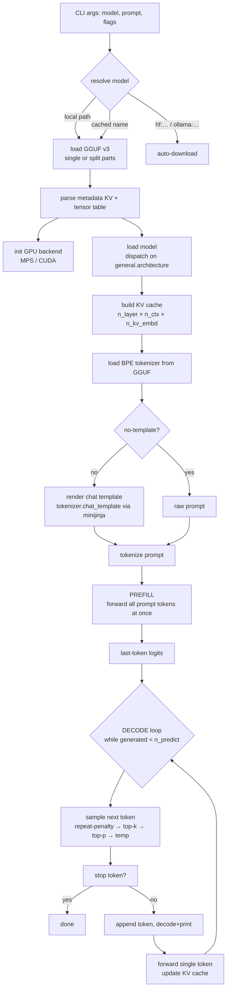
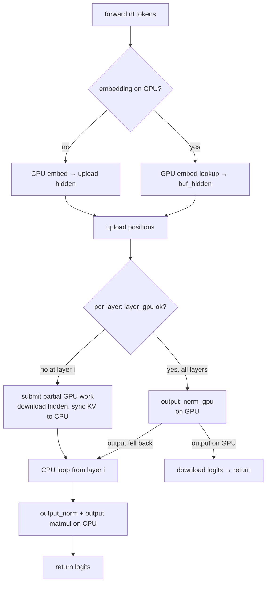

# minfer Architecture

> A pure-Rust LLM inference engine written from scratch, inspired by
> llama.cpp, with **zero ML framework dependencies**. This document describes
> the overall design: module responsibilities, the inference pipeline, the
> CPU / Metal / CUDA backend layering with fallback, quantization, and how to
> add a new model architecture.

---

## 1. Design Principles

1. **No ML framework** — attention, RMSNorm, RoPE, SiLU, softmax are all
   handwritten. Only 5 external crates: `rand`, `regex`, `half`,
   `serde`/`serde_json`, `minijinja`.
2. **Direct execution, not a compute graph** — unlike llama.cpp's
   `ggml_graph`, minfer runs an imperative per-layer forward loop. Simpler,
   easier to trace, and the whole layer can be fused onto the GPU.
3. **Bytes-in / bytes-out tensors** — weight tensors are raw `&[u8]`; SIMD
   dot-product kernels (AVX2 / Metal shaders) operate on byte slices matching
   the exact GGML quantized block layout (`repr(C)` in `block.rs`).
4. **Activations stay f32** — CPU matmuls quantize activations to Q8_0
   on-the-fly; the Metal backend reads f32 activations directly for all weight
   types (matching llama.cpp's Metal backend).
5. **GPU fallback is per-layer and safe** — a layer that cannot run on the GPU
   (e.g. unsupported weight type) submits partial GPU work, downloads the
   hidden state, and continues on the CPU. No silent global fallback.

---

## 2. Module Map

| Module | Responsibility |
|---|---|
| `main.rs` | CLI, GGUF load, chat template, **prefill → autoregressive generation loop**, timing |
| `gguf.rs` | GGUF v3 parser (metadata KV + tensor table + data blob), multi-part (split) support, `ggml_pad` alignment |
| `block.rs` | 20+ quantized block types as `repr(C)` structs + fp16 conversions, matching `ggml-common.h` |
| `avx2.rs` | AVX2+FMA dot-product kernels (Q4_0×Q8_0, Q8_0×Q8_0) + f32→Q8_0 quantization, scalar fallback |
| `kernel.rs` | Quantized matmul dispatch (Q4_0/Q4_1/Q5_0/Q5_1/Q4_K/Q5_K/Q6_K/Q8_0) over activations, CPU scalar fallback |
| `vec_ops.rs` | SIMD vector ops: RMSNorm, RoPE (Qwen2/Llama styles), softmax, SiLU, add/scale/mul |
| `tensor.rs` | 4D `Tensor` (type/shape/strides/`Vec<u8>` data), ggml-compatible strides & byte sizing |
| `cache.rs` | Per-layer KV cache (`k`/`v` `Vec<f32>`, positions, size tracking), architecture-agnostic |
| `sampler.rs` | Repeat-penalty → top-k → top-p → temperature, seeded `StdRng` |
| `tokenizer.rs` | Self-contained BPE tokenizer, loaded from GGUF metadata (no tiktoken) |
| `template.rs` | ChatML / Llama3 / Mistral chat template rendering (minijinja) |
| `models/` | Architecture implementations. `mod.rs` has the `ModelDef` trait + factory dispatch |
| `models/qwen2/` | Qwen2/Qwen2.5: `mod.rs` (model struct + trait impl), `forward.rs` (forward pass), `loader.rs` (GGUF weights + hparams) |
| `metal.rs` + `metal.metal` | Apple MPS (Metal) GPU backend: buffer management, command-buffer encoding, matmul/attention/norm shaders |
| `cuda.rs` + `cuda_kernels.cu` | NVIDIA CUDA backend (feature-gated `--features cuda`): kernels + CUDA Graph capture/replay |
| `download/` | Hugging Face Hub + Ollama download, cached-name resolution, resume support |
| `dump.rs` | Per-layer hidden-state debug dump (gated by `--features debug_dump`) |

---

## 3. Inference Pipeline

The top-level flow lives in `main.rs`. The whole engine is a **single-pass
prefill** followed by an **autoregressive decode loop**.



**Generation parameters** (defaults match llama.cpp): `temp=0.8`, `top_k=40`,
`top_p=0.95`, `repeat_penalty=1.1` (last 64 tokens), `seed=42`, `n_ctx=4096`,
`n_predict=512`.

Timing is dual-caliber: `Prefill:` = prompt tokens / prefill wall time;
`Generated:` = generated tokens / decode wall time (pure decode, matches
llama-bench "Generation" caliber); `Total:` = blended.

---

## 4. The Forward Pass

`ModelDef::forward(tokens, positions, kv)` is the single entry point used by
both prefill (many tokens) and decode (one token). The Qwen2 implementation is
in `models/qwen2/forward.rs`.

### 4.1 Per-layer computation (Qwen2)

```mermaid
flowchart LR
    A[token_embd lookup] --> B[hidden]
    B --> C[RMSNorm attn_norm]
    C --> D[WQ / WK / WV matmuls + bias]
    D --> E[RoPE on Q and K]
    E --> F[store K/V into KV cache]
    F --> G[GQA attention<br/>Q·K^T → softmax → ·V]
    G --> H[WO matmul + bias]
    H --> I[+ residual → hidden]
    I --> J[RMSNorm ffn_norm]
    J --> K[FFN gate + up matmuls]
    K --> L[SiLU(gate) × up]
    L --> M[FFN down matmul]
    M --> N[+ residual → hidden]
    N --> O[next layer / output_norm]
```

GQA: each query head `h` maps to KV head `hk = h / gqa`. The KV head dimension
is independent (`n_kv_embd` read from the K weight's `ne[1]`), so Qwen2.5-0.5B
(n_embd=896, n_head=14, hd=64, n_kv_embd=128) strides correctly.

### 4.2 Prefill vs decode

| Phase | `nt` (tokens) | Strategy |
|---|---|---|
| **Prefill** | ≥ 16 | simdgroup **GEMM** for every quant type (nt≥16), flash prefill attention (`kernel_flash_attn_ext_blk`, hd=64 and hd=128) |
| **Decode** | 1 | fused QKV + FFN gate/up **matmul** kernels, flash decode attention (`kernel_flash_attn_ext_vec`), KV-parallel split attention fallback |

The GPU path skips the per-token CPU→GPU KV drain (no `sync_kv_to_cpu`) because
GPU-layer failure is deterministic by weight type — the sync only happens in
the fallback branch.

---

## 5. Backend Layering & Fallback

The forward pass tries GPU first, then falls back to CPU. This is the central
design decision of the engine:



### 5.1 Selection rules

- **Metal**: layer 0 must have all 7 weight matrices + norms registered on the
  GPU. Within a layer all 7 matrices must be **all Q4 group** (Q4_0/Q4_1) or
  **all QK group** (Q4_K/Q5_0/Q6_K); Q5_1/Q5_K use the f32 path and are exempt.
  `MINFER_DISABLE_MPS=1` forces CPU.
- **CUDA** (`--features cuda`): requires every layer's 7 matrices to be all
  Q4_0/Q4_1 or all Q4_K/Q6_K. Decode replays a captured CUDA Graph.
- **CPU**: always available; AVX2 dispatch via
  `is_x86_feature_detected!("avx2")`, scalar fallback elsewhere.

### 5.2 GPU safety

All Metal submits wait bounded (10 s) and check status; no early return past a
`threadgroup_barrier`; device limits queried at runtime, never hardcoded; guard
failures `gpu_abort` with actual values. See `docs/GPU_SAFETY.md`.

---

## 6. Quantization & Tensor Layout

- **Weight layout** (`block.rs`): `repr(C)` blocks matching `ggml-common.h`.
  Q4_0/Q4_1/Q5_0/Q5_1/Q8_0 = 32-value blocks; Q4_K/Q5_K/Q6_K = 256-value
  super-blocks. Supported: Q4_0, Q4_1, Q8_0, Q4_K, Q6_K, Q5_0, Q5_1, Q5_K
  (CPU + Metal), F32/F16 norms & biases.
- **Activation quantization**: CPU matmuls quantize f32 activations to Q8_0
  on-the-fly (`avx2.rs`); Metal reads f32 directly.
- **GGUF parsing** (`gguf.rs`): `ggml_pad(x, n) = (x + n - 1) & !(n - 1)`
  alignment; tensor strides computed from type block size exactly like
  ggml; split multi-part models are merged into one tensor index.

```mermaid
flowchart LR
    A[GGUF file] --> B[metadata KV<br/>hparams + tokenizer + template]
    A --> C[tensor table<br/>name / type / shape / offset]
    C --> D[quantized data blob]
    D --> E[Tensor{type, shape, strides, Vec<u8>}]
    B --> F[HParams]
    B --> G[Tokenizer]
    B --> H[Chat template]
```

---

## 7. KV Cache

`cache.rs` provides an architecture-agnostic per-layer cache: `k`/`v` are
pre-allocated `Vec<f32>` of `max_size × dim`, `size` tracks the current
sequence length. `store_multi` writes K/V for many positions at once (prefill);
decode writes one. The GPU maintains its own buffers and `sync_kv_to_cpu`
copies them back only on the CPU-fallback path. `MINFER_CACHE_TYPE=f16`
selects an f16 GPU cache (opt-in).

---

## 8. Adding a New Architecture

1. Create `src/models/<name>/` with `mod.rs`, `forward.rs`, `loader.rs`.
2. Add a `match` branch in `src/models/mod.rs::load_model()` for the new
   `general.architecture` value.
3. In `loader.rs`: define `HParams` (including `n_kv_embd`) and `LayerWeights`,
   parse them from GGUF metadata (both `qwen2.*` and `llama.*` prefixes are
   accepted).
4. In `forward.rs`: implement the per-layer forward pass using `kernel::`,
   `vec_ops::`, `cache::` (attention, RoPE with `RopeStyle`, SwiGLU, etc.).
5. In `mod.rs`: implement `ModelDef` (forward, format_chat, special_tokens,
   dims, rope_style).
6. If needed, add a chat template format in `template.rs`.

Architectures that share Qwen2's tensor naming convention (LLaMA, Mistral,
Phi) are the easiest ports. The `RopeStyle` enum already covers Qwen2
(non-interleaved) and Llama (interleaved).

---

## 9. Model Download

`download/mod.rs` resolves `hf:<repo>[:<quant>]` and `ollama:<model>[:<tag>]`
URIs, downloads via curl with size-checked resume, quant-matches single or
split files case-insensitively, and stores them under
`~/.cache/minfer/models`. Cached filenames can be used directly as the model
argument.

---

## 10. Related Documentation

| Topic | Location |
|---|---|
| Metal backend optimizations / gap analysis (primary tracking) | `docs/METAL_OPTIMIZATIONS.md` |
| GPU safety conventions + audit | `docs/GPU_SAFETY.md` |
| CPU backend optimizations | `docs/CPU_OPTIMIZATIONS.md` |
| CUDA backend roadmap / problems | `docs/CUDA_OPTIMIZATION.md`, `docs/CUDA_PROBLEMS.md` |
| Debug dump format | `docs/debug-dump.md` |
| Historical bugs / debugging notes | `docs/BUG-6-KV-CACHE-INDEXING.md`, `docs/QWEN2.5-*`, `docs/DEBUGGING-*` |