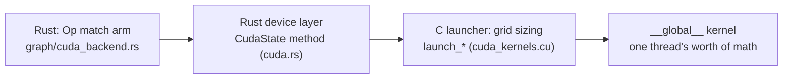

# 03 · Reading minfer's kernels I — elementwise, dequant, embedding

> **Part**: Part 3a — first real kernels. **Prereq**: chapters [01](01-gpu-mental-model.md)–[02](02-minimal-cuda.md) (you can write an elementwise kernel, you know the index formulas and the device memory API).
> **Code**: `src/cuda_kernels.cu`, `src/block.rs`, `src/graph/cuda_backend.rs` — all `file:line` citations verified against the tree at writing time (the function name is the stable address, the line number a convenience).

## 1. Background — where this sits

Chapters 01 and 02 gave you the mental model and the language surface: a kernel
is a function every launched thread executes, threads are grouped into blocks
and blocks into a grid, and the first line of nearly every kernel is the same
index formula that turns those coordinates into one flat position. Chapter 02
also showed you minfer's Rust-side memory wrapper, so you know that device
buffers are opaque `*mut c_void` handles owned by the backend.

This chapter starts the ladder the tutorial is really about: **reading
minfer's actual kernels**. We take the three easiest kernel families in the
file — the elementwise add pair, the Q4_0 weight dequantizer, and the
embedding gather — and read each one the way a contributor should: source
excerpt, line by line, then the CPU counterpart from the
[inference walkthrough](../inference_e2e_walkthrough/README.md), then the
performance arithmetic. These are not warm-ups chosen for cuteness. Every
single forward pass of the graph executes them: the residual stream is a chain
of `add_f32` calls, every quantized weight that feeds the f16 prefill GEMM was
produced by a `dequant_q*_f16` kernel, and the very first real op of any
transformer forward — turning token ids into vectors — is `embed_rows_q4_0`
or one of its type siblings.

You will also meet the **dispatch chain**, the pattern every later chapter
reuses:



Keep it in mind while reading: a graph node named `Add` does not "run
`add_f32`" directly. It runs a Rust match arm, which calls a CudaState method,
which calls a C launcher that computes the grid, which finally launches the
kernel. Four hops, each with a distinct job. When a later chapter says "the
`Op::MatMul` arm routes to MMQ", you will know exactly which hop does the
routing.

## 2. Principle — the concepts

### 2.1 The kernel inventory — the map of `cuda_kernels.cu`

The forensics protocol from `STYLE.md` starts with enumeration. Run:

```bash
grep -n '__global__' src/cuda_kernels.cu
```

Today that prints **89 kernels** in an 8,386-line file. Nobody memorizes 89
entries; you navigate by family. Here is the map (counts from the same grep):

| Family | Examples (first hit line) | What it does | Where taught |
|---|---|---|---|
| Elementwise / epilogue | `add_f32` :2403, `add_bias_f32` :2391, `silu_f32` :2429, `rope_f32` :2503, `store_kv_f16` :2550 | one pass over a buffer, per-element math | **this chapter** |
| Dequant to f16 | `dequant_q8_0_f16` :4434 … `dequant_q6_k_f16` :4585 | quantized weight bytes → dense f16 | **this chapter** |
| Embedding gather | `embed_rows_q8_0` :2061 … `embed_rows_q4_1` :3615 | token ids → dequantized weight rows | **this chapter** |
| Small helpers | `gather_rows_f32` :2046, `f32_bits_to_i32` :2489, `convert_f32_f16_kernel` :4614 | glue: format conversion, device-side decodes | **this chapter** (quick-read) |
| Decode matvec (MMVQ) | `q4_k_q8_mmvq` :1254, `q4_0_q8_mmvq` :8091 | one output row per block, dp4a integer dots | ch 04 |
| Prefill GEMM | `gemm_f16_nt_kernel_t` :4787, `mmq_nt_kernel` :5663 | tiled tensor-core GEMM, f16 or int8 | ch 04 |
| Attention | `gqa_attn_f32_f16kv` :2677, `fa_prefill_f16kv` :4157 | GQA attention, flash-style prefill | ch 05 |
| Fused decode tail | `attn_bias_rope_store_f32` :2590 | bias×3 + rope×2 + store×2 in one launch | ch 05 |
| Activation quantize | `quantize_q8_0_pad40_t` :794, `rms_norm_quant_f32_t` :881 | f32 activations → q8 blocks for MMQ | ch 04 |

Two structural facts the table hides, and both matter for reading:

1. **Kernels and launchers live in the same file, but are different APIs.**
   The `__global__` functions are device code. The `void launch_*` functions
   (plain C++, called through FFI from Rust) own the grid arithmetic. When you
   want to know "how many threads does this launch", find the launcher, not
   the kernel.
2. **Type-generic dispatch is done with `switch (type_id)`, not C++
   templates.** `launch_embed_rows` (:3643) and `launch_dequant_f16` (:5043)
   each take an integer type id and select one of eight concrete kernels. The
   Rust side owns the id tables — and, as §3.2 will show, the two tables do
   not use the same numbering. That is a real trap when you first read the
   code.

### 2.2 The three thread-to-data mapping patterns

Nearly every easy kernel in the file answers one question first: *what does
one thread process?* The elementwise/dequant/embed families use three answers:

- **One thread per element** — `add_f32`, `mul_f32`, `silu_f32`,
  `f32_bits_to_i32`. Index = flat position. Simplest possible; used when the
  per-element work is trivial.
- **One thread per 32-element quant block** — the `dequant_q*_f16` family and
  the 32-element `embed_rows_*` variants. Q4_0 stores 32 values in 18 packed
  bytes; unpacking them one element per thread would mean every thread
  re-reading the scale byte and masking its own nibble out of a shared byte.
  Giving one thread the whole block lets it read the scale once and write a
  contiguous run of outputs.
- **One thread per N elements (vectorized)** — `convert_f32_f16_kernel`
  processes 8 elements per thread so it can load a `float4` pair and store
  `__half2` pairs (§3.4). Same math, fewer memory transactions.

And the grid comes from one formula, the ceil-div you met in chapter 02:

```c
grid = (total + block - 1) / block;   // ceil(total / block)
if (grid > 2147483647LL) grid = 2147483647LL;   // x-dimension cap
```

You will find that pair (or its `dim3` variant) in every launcher. Two details
worth internalizing now. First, the launcher computes `total` in a `long long`
— products like `od * (id / 32)` can overflow `int` for large matrices, and
the 64-bit accumulation happens *before* the cast to the grid dimension.
Second, the `2147483647LL` clamp is a defensive guard, not a live case in any
verified model — the CUDA x-dimension limit is 2³¹−1 and minfer simply refuses
to exceed it rather than launch something invalid.

### 2.3 Where the Rust side hands over

`src/cuda.rs` declares the launchers in an `extern "C"` block (the FFI
surface, e.g. `launch_add_f32` at `cuda.rs:227`, `launch_dequant_f16` at
`:340`) and wraps each in a small safe method on `CudaState`. The graph
backend never sees kernel names; it sees graph ops. The three call sites this
chapter follows:

- `Op::Add` → `CudaState::add_f32` — `src/graph/cuda_backend.rs:483`
- the MatMul bias epilogue → `CudaState::add_bias_f32` — `:990`
- `Op::GetRows` → `embed_rows_on_gpu` / `gather_rows_f32_on_gpu` — `:452` / `:466`

One safety rule from `docs/GPU_SAFETY.md` colors all of these arms: when a
kernel's input violates its invariants (wrong sizes, unsupported layout), the
arm returns `Err` from `execute_node`. There is no silent fallback to another
backend mid-run — backend assignment was decided at build time.

## 3. In minfer's code

### 3.1 `add_f32` and `add_bias_f32` — the residual stream

The transformer's residual stream ("the highway where each layer's
contribution is an *update*, not a replacement" — walkthrough doc 11 §2.0) is
executed by these two kernels. In the 0.5B graph the residual adds are among
the most frequent nodes (doc 05 walks the topology; doc 11 explains the
pre-norm layout), which makes them the right first read: they are everywhere,
and they are the "hello world" shape of this codebase.

The kernel — `src/cuda_kernels.cu:2403`:

```c
__global__ void add_f32(
    const float* __restrict__ x,
    const float* __restrict__ y,
    float* __restrict__ z,
    int n
) {
    int tid = blockIdx.x * blockDim.x + threadIdx.x;
    if (tid >= n) return;
    z[tid] = x[tid] + y[tid];
}
```

Line by line:

- **`blockIdx.x * blockDim.x + threadIdx.x`** — the chapter-02 index formula.
  Blocks are 1-D, threads are 1-D, so every thread gets a unique flat index
  over the whole grid.
- **`if (tid >= n) return;`** — the guard. The grid is ceil-div sized, so the
  last block usually launches more threads than there are elements; the
  surplus threads exit here instead of writing past the buffer. (The
  mismatched-shape failure mode this prevents is exactly Toy #2's exercise.)
- **`z[tid] = x[tid] + y[tid];`** — the whole "computation": one fused
  multiply-add-free, cache-line-friendly load-load-store. The
  `__restrict__` qualifiers promise the compiler the three buffers do not
  alias, which lets nvcc keep the loads before the store.

The launcher — `src/cuda_kernels.cu:3880`:

```c
void launch_add_f32(
    const float* x, const float* y, float* z, int n, cudaStream_t stream
) {
    int block_sz = 256;
    dim3 block(block_sz, 1, 1);
    dim3 grid((n + block_sz - 1) / block_sz, 1, 1);
    add_f32<<<grid, block, 0, stream>>>(x, y, z, n);
}
```

The **ceil-div is over the total element count `n`** — not over tokens, not
over rows. 256 threads per block is the file's default block size (a multiple
of 32, the warp width, so no partially-filled warp). The stream argument
(`cudaStream_t` — a queue of device work; every kernel in one stream runs in
order) is threaded through from Rust so the backend can order its own work
without global synchronization.

The Rust call chain: the backend's `Op::Add` arm checks that both inputs have
the same element count as the output and calls
`CudaState::add_f32` (`src/cuda.rs:4182`), which is a three-line FFI shim.
The dispatch site is `src/graph/cuda_backend.rs:478`:

```rust
Op::Add => {
    let n = self.elems(out_buf);
    if self.elems(in_bufs[0]) != n || self.elems(in_bufs[1]) != n {
        return Err(format!("cuda: {}: add input size mismatch", node.name));
    }
    self.state.add_f32(
        self.ptr_of(in_bufs[0])?,
        self.ptr_of(in_bufs[1])?,
        self.ptr_of(out_buf)?,
        n,
    );
    Ok(())
}
```

Note what the arm does *not* do: it does not know or care that this Add is a
residual. Graph topology (built in `GraphBuilder`) decided the wiring; the
backend only sees buffers and counts. And the shape mismatch is an `Err` —
the GPU_SAFETY rule from §2.3, applied to a five-line kernel.

**`add_bias_f32`** looks similar but solves a different indexing problem —
broadcasting a one-dimensional bias across token rows. Kernel,
`src/cuda_kernels.cu:2391`:

```c
__global__ void add_bias_f32(
    float* __restrict__ y,
    const float* __restrict__ b,
    int d
) {
    int t = blockIdx.x, i = threadIdx.x + blockIdx.y * blockDim.x;
    if (i >= d) return;
    y[t * d + i] += b[i];
}
```

- **`blockIdx.x` is the token row `t`** — one block per row of the
  `[nt][d]` activation buffer, *not* one thread per element of the whole
  buffer. This is the second mapping pattern of §2.2 in a 2-D disguise: the
  grid encodes the row, the thread index encodes the column.
- **`threadIdx.x + blockIdx.y * blockDim.x`** — the column index. `d` can
  exceed one block's width (a 0.5B layer has `d = 896`; a 7B one has 3,584 or
  18,944), so the launcher folds the remainder into `grid.y`:
  `grid(n, (d + 63) / 64)` with 64 threads per block
  (`launch_add_bias_f32`, `cuda_kernels.cu:3872`). For 896: `grid.y = 14`,
  so a 30-token prefill launches 30 × 14 = 420 blocks of 64.
- **`y[t * d + i] += b[i];`** — in-place accumulate. The bias vector `b[i]`
  is read by every row, so it stays hot in L2 across the grid.

The bias call site sits *inside* the MatMul arm
(`src/graph/cuda_backend.rs:931`, epilogue at `:990`), and the comment there
records the one bug-prone detail of this kernel's contract:

```rust
// add_bias_f32's last argument is the ROW COUNT (nt), not
// the total element count — the kernel grid maps one block
// row per token (a wrong count writes out of bounds).
self.state.add_bias_f32(self.ptr_of(out_buf)?, bptr, od, nt);
```

Pass the element count instead of the row count and `grid.x` becomes `nt * d`
rows — the kernel indexes `y[t * d + i]` far past the buffer. The Rust
wrapper's docstring (`src/cuda.rs:4204`) repeats the warning. This is the
chapter's first lesson in **grid-shape contracts**: a kernel is not just its
body, it is the geometry its launcher assumes.

**CPU counterpart.** Doc 11 §2.0–§2.1 walks the same residual adds on the CPU
(`Op::Add` nodes over the residual stream, `vec_ops.rs` helpers), and doc 06
covers how the fusion pass minimizes how often they materialize. The math is
identical; the only difference is who schedules the loop — the CPU does a
`vec_add_f32` over one core's SIMD lanes, the GPU spreads it across 26,880
threads (§4 does that arithmetic).

### 3.2 `dequant_q4_0_f16` — unpacking 4-bit weights on device

#### The data layout first

Everything in this section depends on 18 bytes. `src/block.rs:51`:

```rust
// Q4_0 — 4-bit quantization, 32 elements per block (line 184-189)
// Each value is stored as a 4-bit nibble (signed, offset by 8)
// Scale is fp16
#[derive(Clone, Copy)]
#[repr(C)]
pub struct BlockQ4_0 {
    pub d: Fp16,      // delta (scale)
    pub qs: [u8; 16], // nibbles / quants (32 × 4-bit = 16 bytes)
}
```

with `pub const Q4B: usize = 18` at `block.rs:18` and a compile-time
`assert!(core::mem::size_of::<BlockQ4_0>() == 2 + 16)` at `:191`. So the
byte layout is exactly:

```text
one BlockQ4_0 = 18 bytes = 32 dequantized f32/f16 values
┌──────────┬─────────────────────────────────────────────┐
│ d (2 B)  │ qs[0] … qs[15] (16 B = 32 nibbles)          │
│ f16 scale│ byte j holds: LOW nibble = elem j,          │
│          │              HIGH nibble = elem j+16        │
└──────────┴─────────────────────────────────────────────┘
value = d * (nibble - 8)        // the +8 stored offset
```

Two conventions to burn in, because every quant kernel in the file assumes
them:

- **Nibble order**: element `j` comes from the **low** 4 bits of byte `j`;
  element `j + 16` from the **high** 4 bits. The kernel comment states it
  verbatim (`cuda_kernels.cu:2097`) and both the embed and dequant kernels
  implement it identically.
- **The +8 offset**: minfer (like llama.cpp) stores `round(v/d) + 8`, so the
  unsigned nibble 0..15 maps back by subtracting 8 — that is the `- 8.0f`
  you will see in every Q4_0 body. Q4_K weights instead carry a per-sub-block
  `min` (walkthrough doc 10 §2.4 covers the CPU side of that pairing).

#### The kernel

`src/cuda_kernels.cu:4449` (family header + type-id table at `:4421`):

```c
__global__ void dequant_q4_0_f16(
    const uint8_t* __restrict__ w, __half* __restrict__ out, int od, int id
) {
    int nb = id / 32;
    long long g = (long long)blockIdx.x * blockDim.x + threadIdx.x;
    if (g >= (long long)od * nb) return;
    int row = (int)(g / nb);
    const uint8_t* blk = w + g * 18;
    float d = h2f(*reinterpret_cast<const uint16_t*>(blk));
    const uint8_t* q = blk + 2;
    __half* o = out + (long long)row * id + (int)(g % nb) * 32;
    // minfer Q4_0 stores round(v/d) + 8 (same -8 offset as the matmuls).
    #pragma unroll
    for (int i = 0; i < 16; i++) {
        o[i]      = __float2half(d * (float(q[i] & 0x0F) - 8.0f));
        o[i + 16] = __float2half(d * (float(q[i] >> 4) - 8.0f));
    }
}
```

**What one thread processes: one 32-element block — precisely one `BlockQ4_0`
of one weight row.** Not one element, not one row. `nb = id / 32` is the
number of blocks per row (input dim `id` split into 32-value groups); the
grid has `od * nb` threads. Reading it line by line:

- **`g` in `long long`** — the global thread index, computed in 64 bits
  because `od * nb` for a 7B-class tensor is in the millions and a 32-bit
  intermediate is an overflow waiting for a bigger model.
- **`row = g / nb`** and the `g % nb` below split the flat index back into
  (row, block-within-row). Same 2-D-from-1-D trick as `add_bias_f32`, but
  derived instead of launched.
- **`blk = w + g * 18`** — the source pointer. Because the weight stream is
  row-major and each row is exactly `nb` blocks, the flat block index `g` is
  *also* the byte offset in units of 18. This only works because the row
  length `id` is a multiple of 32 — the backend gates it before dispatching:
  the MatMul arm rejects `id % 32 != 0` (`cuda_backend.rs:960`) and the f16
  warm path requires `id % 256 == 0` (`cuda.rs:3797`).
- **`h2f(...)`** — the file's helper (`cuda_kernels.cu:26`): reinterpret the
  2 scale bytes as `__half` and convert to f32. The scale is stored f16, read
  once per block.
- **The unrolled loop** — each byte yields two f16 outputs: `& 0x0F` takes the
  low nibble (elements 0–15), `>> 4` the high nibble (elements 16–31),
  subtract 8, multiply by the scale, convert to half with
  `__float2half` (round-to-nearest). `#pragma unroll` tells nvcc to expand
  the 16 iterations; the loop bounds are compile-time constants, so the
  branch-free expansion is free code size for eliminated loop overhead.
- **`o = out + row * id + (g % nb) * 32`** — the destination pointer: row
  start in the dense `[od][id]` f16 matrix, plus 32 elements per block. The
  writes of one thread are fully contiguous.

The launcher — `src/cuda_kernels.cu:5043`:

```c
void launch_dequant_f16(
    int type_id, const uint8_t* w, __half* out,
    int od, int id, int block_stride, cudaStream_t stream
) {
    int block = 256;
    long long total;
    switch (type_id) {
        case 7: total = (long long)od * (id / 16); break;            // q6_K
        default: total = (long long)od * (id / 32); break;           // all others
    }
    long long grid = (total + block - 1) / block;
    if (grid > 2147483647LL) grid = 2147483647LL;
    switch (type_id) {
        case 0: dequant_q8_0_f16<<<(int)grid, block, 0, stream>>>(w, out, od, id); break;
        case 1: dequant_q4_0_f16<<<(int)grid, block, 0, stream>>>(w, out, od, id); break;
        ...
```

Grid = ceil-div over **`od * nb` blocks** (Q6_K splits into 16-element
sub-blocks, hence its special case). One launch geometry serves eight quant
types; only the per-thread decode differs.

#### Who calls it, and when — the honest picture

The series shorthand is "quantized weights are dequantized to f16 on device
at load" (`STYLE.md`, series facts). Reading the code gives you the precise
version, which is worth knowing because it explains *when* you will see these
kernels in a profile:

- The **persistent f16 weight cache** (Phase 8p) is warmed **at load time**
  by the model loaders: `enable_w16_cache` + `warm_w16` per weight
  (`src/models/qwen2/loader.rs:580-591`; the `warm_w16` body at
  `src/cuda.rs:3782` maps `TensorType` → the same type ids and calls
  `w16_get`, which launches the dequant). But only for models whose matmul
  weights total ≥ `W16_ENABLE_BYTES` = 2 GiB (`src/cuda.rs:1136`) **and**
  when the int8 MMQ prefill path is not active
  (`qwen2/loader.rs:578`). A 0.5B Q4_0 model is far below that bar (its
  largest tensor, `tok_embd`, is 76.6 MB in Q4_0 — §4.1) and therefore runs
  **no** dequant at load today.
- Otherwise `launch_dequant_f16` runs **per call** into a scratch buffer,
  from the f16 prefill GEMM path `prefill_gemm_f16`
  (`src/cuda.rs:3745`, launch at `:3848`).
- Why a cache at all: the two-pass prefill GEMM used to dequantize W on
  *every* call — "288 ms per 7B @2K forward" — because weights are immutable
  after registration, the dequant result is cached per weight pointer
  (`w16_cache` comment, `src/cuda.rs:1151`).

And why dequantize at all, when the CPU side made a point of *never*
dequantizing at load (walkthrough doc 10 §2.1's bandwidth argument)? The
answer is the weight-residency rule plus the hardware target: weights are
uploaded once and stay on the GPU for the process lifetime
(`docs/CUDA-TECH-PRIMER.md` §6.1), so an f16 copy costs device memory
capacity but no per-token PCIe/host traffic; and the tensor-core GEMM wants
dense f16 tiles — `wmma` fragments cannot read nibble-packed blocks. On the
CPU, dequantizing at load would quadruple RAM and the bytes streamed per
token; on the GPU it buys access to hardware the packed format cannot feed.
(One line, as promised: TECH-PRIMER §6.1 + `docs/CUDA-BACKEND-DESIGN.md` hold
the full story.)

An honest footnote from the same dispatch comment
(`src/cuda.rs:2647-2658`): the *default* prefill today is the int8 MMQ GEMM,
which streams raw quantized bytes and never touches `dequant_*_f16` —
`MINFER_MMQ=0` escapes to the f16 wmma path that does. Both paths coexist;
§5 shows how to run each.

**CPU counterpart.** Doc 10 §2.1 is the CPU-side dequant argument and §2.4
the K-quant pairing (Q8_K activations with precomputed `bsums`); the CPU
dequantize helpers live in `quants.rs` and the scalar reference formula
`(nibble − 8) · d` appears in doc 10's parity notes. The GPU kernel is the
same formula — that is the point of the parity tests.

### 3.3 `embed_rows_q4_0` — the gather

The first real op of every forward: turn token ids into embedding vectors.
The family comment (`src/cuda_kernels.cu:2040`) states the job:

```c
// Embedding = gather + dequantize weight rows on device (removes the CPU
// round trips around the prefill's embed and G3 tail get_rows). ids are
// I32-as-f32 bit patterns (exact for |v| < 2^24), read via __float2int_rn.
// The generic f32 gather (get_rows: out[t*n+i] = x[ids[t]*n+i]) shares the
// f32 kernel.
```

The kernel — `src/cuda_kernels.cu:2081`:

```c
__global__ void embed_rows_q4_0(
    const uint8_t* __restrict__ w,
    const float* __restrict__ ids,
    float* __restrict__ out,
    int n_embd, int nt
) {
    const int BS = 18; // f16 d + 16 nibble bytes
    int nb = n_embd / 32;
    int tid = blockIdx.x * blockDim.x + threadIdx.x;
    if (tid >= nt * nb) return;
    int t = tid / nb, b = tid % nb;
    int id = __float_as_int(ids[t]); // I32-as-f32 bit pattern (graph rule §4)
    const uint8_t* blk = w + ((long long)id * nb + b) * BS;
    float d = h2f(*reinterpret_cast<const uint16_t*>(blk));
    const uint8_t* q = blk + 2;
    float* o = out + (long long)t * n_embd + b * 32;
    // element j = LOW nibble of byte j; element j+16 = HIGH nibble.
    // minfer Q4_0 stores round(v/d) + 8 (same -8 offset as the matmuls and
    // the CPU embed path).
    #pragma unroll
    for (int i = 0; i < 16; i++) {
        o[i]      = d * (float(q[i] & 0x0F) - 8.0f);
        o[i + 16] = d * (float(q[i] >> 4) - 8.0f);
    }
}
```

**What one thread processes: one 32-element block of one token's embedding
row** — `t = tid / nb` picks the token, `b = tid % nb` the block within that
token's row. The dequant body is byte-for-byte the Q4_0 recipe from §3.2;
what is new is the *gather* around it:

- **`int id = __float_as_int(ids[t]);`** — the graph convention that integer
  inputs (token ids, positions) ride through f32 buffers as **bit patterns**
  (`f32::from_bits(v)` at fill time — `src/graph/alloc.rs:438`,
  `fill_input_i32`). `__float_as_int` is a *bit reinterpretation*, not a
  numeric conversion: it hands back the exact i32 that was stored. A reading
  note in the forensics spirit: the family comment above still says "read
  via `__float2int_rn`", but the code below it bit-casts — the comment
  drifted, the bit-cast is the correct choice, because `__float2int_rn`
  rounds a *float value* and would mangle any bit pattern that is not a small
  float. When comment and code disagree, the code plus the parity tests win —
  and you just learned why this convention exists: it lets the allocator
  treat all inputs as bytes while keeping kernels CUDA-Graph-replayable with
  no host sync.
- **`blk = w + ((long long)id * nb + b) * BS`** — the gather itself. `id`
  (the token) selects the row, `b` the block, `BS = 18` the block stride.
  One long multiply guards the `id * nb` product (a 151,936-row table times
  28 blocks overflows nothing here, but the guard is the habit).

**How this maps to the weight layout convention.** Repo AGENTS rule 4: weight
metadata is `[in, out]`, memory is row-major `[out][in]`; activations are
token-major `[nt][d]`. For `token_embd` the metadata shape is
`[n_embd, n_vocab] = [896, 151936]` on 0.5B, so memory holds **151,936 rows
of 896 contiguous values** — row `id` is exactly token `id`'s embedding
vector. The gather is then the degenerate matmul: a one-hot times the weight
matrix picks one row (doc 05's graph excerpt shows the node:
`embed(3) GetRows — h = one token_embd row per id, [896, nt]`). The output is
token-major f32 `[nt][896]` — the layout every later kernel assumes.

**Dispatch.** The backend arm (`src/graph/cuda_backend.rs:442`) matches
`Op::GetRows` on metadata: with `NodeMeta::Embed` it calls
`embed_rows_on_gpu` (`:452`), with plain metadata it calls the generic
`gather_rows_f32_on_gpu` (`:466`) — the same `GetRows` node serves the
embedding *and* the tail-row selects before `lm_head` (doc 09 §2.4). The
Rust wrapper (`src/cuda.rs:4111`) maps `TensorType` to `(type_id,
block_stride)` — `Q4_0 => (1, 18)` at `:4124` — and `F32` embeddings skip the
quant kernels entirely by calling the f32 gather (`:4133`). The C launcher
(`launch_embed_rows`, `cuda_kernels.cu:3643`) computes the grid per type
(eight `embed_rows_*` kernels behind one `switch`) with the same
one-thread-per-32-block geometry.

Note what this kernel does **not** do: it does not consult any f16 cache.
Embedding rows are read once per token per step — a gather of `nt` rows out
of 151,936 — so materializing the whole table as f16 would only grow the
footprint. Matmul weights read *every* row on *every* call, which is why they
get the cache (§3.2) and the embedding does not. Same quant format, opposite
caching decisions, and the read pattern is why.

**CPU counterpart.** Doc 05 introduces the `GetRows`/embedding node and its
CPU execution (`b.embedding(...)` → `cpu_backend`'s get_rows), doc 09 §3.2
shows the tail-row selects in the prefill path, and doc 11 §2.1 explains why
the graph has `GetRows` nodes at the lm_head at all. The CPU path pays a
host↔device round trip for a GPU-resident model — the family comment's
"removes the CPU round trips" is the reason the kernel exists.

### 3.4 Quick-read table — the small helpers

Three glue kernels you will meet constantly; one row each, with the one line
that carries the idea.

| Kernel (file:line) | Purpose | The one interesting line |
|---|---|---|
| `convert_f32_f16_kernel` (`cuda_kernels.cu:4614`) | f32 activations → f16, feeding the wmma prefill GEMM | `:4619` — `base = (…blockIdx.x * blockDim.x + threadIdx.x) * 8`: the thread index is **multiplied by 8**; each thread `float4`-loads 8 f32 and stores 4 `__half2` (`:4624`), 8× fewer transactions for the same traffic (the P1 comment at `:4617`). Launcher `launch_convert_f16` `:5067` sizes the grid over `n/8`. |
| `f32_bits_to_i32` (`cuda_kernels.cu:2489`) | positions/token ids arrive as I32-as-f32 bit patterns; rope/store/attention kernels want raw `int*` | `:2496` — `dst[tid] = __float_as_int(src[tid]);` the whole kernel *is* that line: one device-side bit reinterpretation pass, so the per-layer path never syncs with the host (comment `:2483`). Rust entry `bits_to_i32` `cuda.rs:5121`, called from `positions_i32` (`cuda_backend.rs:1210`, launch `:1238`). |
| `gather_rows_f32` (`cuda_kernels.cu:2046`) | the quant-free `GetRows`: `out[t*n+i] = x[ids[t]*n+i]` | `:2058` — `out[idx] = src[(long long)id * n + i];` the classic gather: one flat index decoded into `(t, i)`, the id looked up per thread. Same `(1, 18)`-style dispatch you saw in §3.3 is what routes F32 embeddings and the tail-row selects here. |

All three are one-thread-per-element kernels with the usual ceil-div launcher;
if §3.1 made sense, these read themselves.

## 4. Performance intuition

### 4.1 Bytes per element — before and after dequant

The fixed exchange rate of this chapter, from the block layouts
(`block.rs:16-22`, walkthrough doc 02):

| Representation | Bytes / element | 0.5B tok_embd (151,936 × 896) |
|---|---|---|
| Q4_0 packed | 18/32 = **0.5625 B** | 76,575,744 B ≈ **76.6 MB** |
| f16 (dequant target) | **2 B** | 272,269,312 B ≈ **272.3 MB** |
| f32 (CPU reference) | 4 B | 544,538,624 B ≈ **544.5 MB** |

What that does to bandwidth, both directions:

- **Every kernel that reads the f16 copy pays 3.56× the weight bytes** that
  the packed MMQ kernels pay (2 vs 0.5625 B/elem). That is the standing cost
  of the f16 prefill path, and the reason the int8 MMQ GEMM — which streams
  raw nibbles — is the default (dispatch comment, `src/cuda.rs:2651-2656`).
- **The one-time dequant itself moves ≈ 349 MB** (read 76.6 + write 272.3)
  per weight tensor of that size, which is why the campaign cached the
  result: doing it per call cost a measured 288 ms per 7B @2K forward before
  Phase 8p (`src/cuda.rs:1153`).
- Versus f32, the f16 copy still halves weight traffic — the same 2× argument
  that made the *KV* cache f16 (Phase 8b).

### 4.2 Threads launched — three real launches

Dims verified in-repo: Qwen2.5-0.5B has `n_embd = 896`, 24 layers
(`docs/QWEN2-SUPPORT.md:79`), and `n_vocab = 151936` (walkthrough doc 09
§2.4: the 0.5B `lm_head` costs `30 × 896 × 151936`).

**Embed gather, 30-token prefill** (`embed_rows_q4_0`):
`nb = 896 / 32 = 28` blocks per row, so `total = nt × nb = 30 × 28 = 840`
threads → `grid = ceil(840 / 256) = 4` blocks → **1,024 threads launched,
840 doing work, 184 exit at the guard**. Eight hundred threads to embed a
whole prompt. The kernel is not bandwidth-limited here — it is
*launch-bound*: at the campaign's "2 µs/graph-gap scale" per launch
(`docs/CUDA-TECH-PRIMER.md` §6.4), a launch of this size costs more than its
memory traffic (840 × (18 B read + 128 B written) ≈ 123 KB). This is why
fused epilogues, not gather micro-optimizations, dominate decode-step
latency — the story chapters 05–06 continue.

**Full-table dequant, 0.5B tok_embd** (`dequant_q4_0_f16`):
`total = od × nb = 151,936 × 28 = 4,254,208` threads →
`grid = ceil(4,254,208 / 256) = 16,618` blocks. Now the launch is fully
saturated and the kernel is a pure streaming pass: 18 B read + 64 B written
per thread. Watch the *write amplification*: each thread writes 32 f16
(64 B) from 18 source bytes — the ratio is 3.56, exactly the storage
expansion of §4.1 seen per thread.

**Residual add, 30-token prefill** (`add_f32` over `[30][896]`):
`n = 26,880` → `grid = ceil(26,880 / 256) = 105` blocks. Bytes moved:
read 2 × 4 B + write 4 B = **12 B per element for 2 flops** — an arithmetic
intensity of ~0.17 FLOP/byte. No amount of compute throughput rescues that
ratio; the kernel is memory-bound by construction, and the only levers are
moving fewer bytes (fusion — do not write `z` and re-read it) and
coalescing (already free here: thread `tid` reads elements `tid`, fully
contiguous).

### 4.3 What would make them slow

- **A wrong grid contract.** Pass element count instead of row count to
  `add_bias_f32` and you launch `nt × d` block-rows — out-of-bounds writes,
  not a slowdown but a crash or silent corruption (the call-site comment,
  `cuda_backend.rs:987`).
- **Element-per-thread dequant.** One thread per *element* would re-read the
  scale byte and re-enter the nibble 32× more often per output; the
  block-per-thread shape exists to amortize the scale read and emit
  contiguous 64 B runs.
- **Uncoalesced nibble loads.** The 18-byte block reads are not full 128 B
  transactions, but consecutive threads read consecutive 18-byte blocks, so
  the hardware coalescer still streams them densely; an interleaved or
  transposed block order would destroy that.
- **Divergence.** All three kernels guard-and-exit once, at a boundary
  aligned across whole warps' worth of threads (the tail block only). There
  is no data-dependent branching inside the loop, so the SIMT execution stays
  lockstep — the divergence term from chapter 01 never comes into play here.

## 5. Try it / Observe

Three commands, all from the repo root (build details and the ccbin/arch
pitfalls: [`docs/BUILD.md`](../BUILD.md)):

```bash
# 1. build with the CUDA backend (needs nvcc on PATH or /usr/local/cuda/bin)
cargo build --release --features cuda

# 2. run one prompt through the graph on the GPU
./target/release/minfer <model.gguf> "hi"

# 3. same run, but force the prefill down the f16 dequant path of §3.2
#    (default prefill is int8 MMQ; MINFER_MMQ=0 escapes to the f16 wmma GEMM)
MINFER_MMQ=0 ./target/release/minfer <model.gguf> "hi"
```

To *see* the kernels, record a trace and open the visualizer
(`viz/README.md` is the one-line reference: the viz page replays a recorded
graph with per-node **real tensor statistics** — min/max/mean + a value
heatmap — and the token/logit distributions per decode step):

```bash
MINFER_TRACE=/tmp/t.json ./target/release/minfer <model.gguf> "hi"   # record
cd viz && python3 -m http.server 8080     # open http://localhost:8080, load /tmp/t.json
```

What to look for in the trace: the `GetRows` node that is the first real op
(embed §3.3), the residual `Add` nodes between every sub-block (§3.1), and —
under `MINFER_MMQ=0` — the prefill MatMuls that route through the
dequantize-then-GEMM pair instead of MMQ. `MINFER_NO_CUDA_GRAPH=1` reverts
CUDA Graph replay to per-kernel launches if you want launch-level visibility.

## 6. Cross-references

- **[04 · Reading minfer's kernels II](04-kernels-matmul.md)** — next: the
  matmul ladder, from scalar GEMV to tiled tensor-core GEMM to int8 MMQ.
  This chapter's dequant kernels are that chapter's warm-up act.
- **[02 · The minimal CUDA you actually need](02-minimal-cuda.md)** — the
  index formulas and memory API this chapter assumed.
- **[Walkthrough 10 · CPU matmul](../inference_e2e_walkthrough/10-cpu-matmul-kernels.md)**
  — the CPU counterpart of §3.2: the dequant-at-load bandwidth argument
  (§2.1) and the K-quant activation pairing (§2.4).
- **[Walkthrough 11 · Attention, vec ops, KV](../inference_e2e_walkthrough/11-attention-vecops-kv.md)**
  — the CPU side of §3.1's residual stream and the rest of the vec-op glue.
- **[`docs/SUPPORT-MATRIX.md`](../SUPPORT-MATRIX.md)** — the quant support
  grid (Q4_0 row: 18 B/32 val, CPU+CUDA+Metal all ✅) and the CUDA notes on
  which prefill/decode paths serve which types.
- **[`docs/CUDA-TECH-PRIMER.md`](../CUDA-TECH-PRIMER.md)** — §6.1 weight
  residency (the why behind f16 caches), §6.4 the elementwise family map.
- **[`viz/README.md`](../../viz/README.md)** — the trace format and viz page.

← [02 · The minimal CUDA you actually need](02-minimal-cuda.md) · [Index](./README.md) · [04 · Reading minfer's kernels II →](04-kernels-matmul.md)
