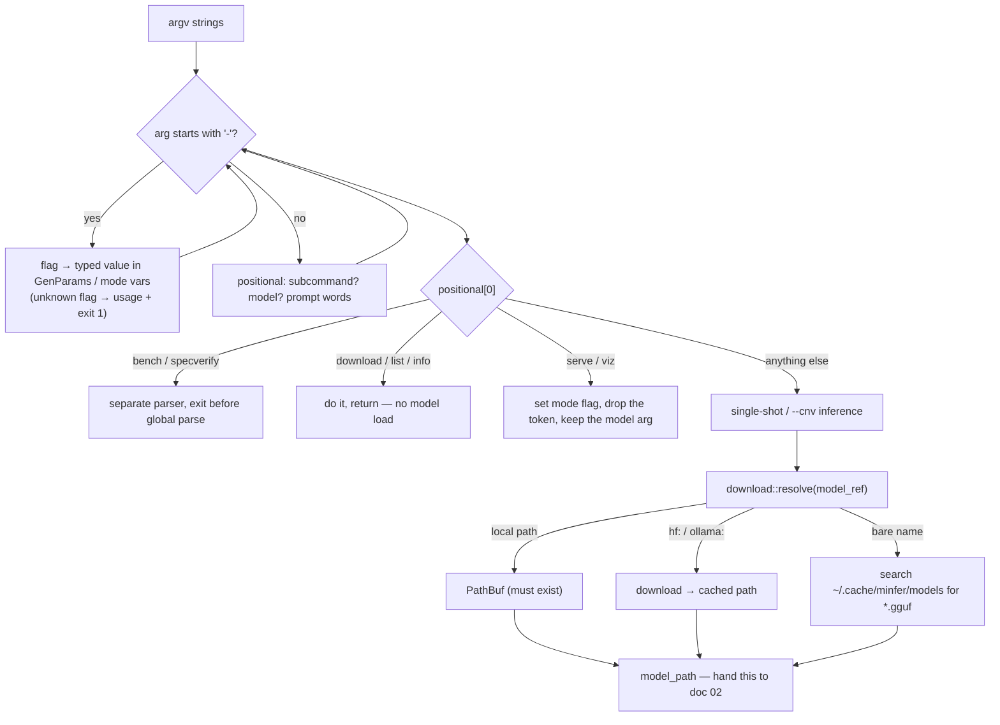

# 01 · CLI args and model resolution

> **Stage**: user types the command → **this stage** → GGUF file opens
> (doc 02). Here the shell hands minfer a list of strings; this stage turns
> that list into (a) typed generation parameters, (b) a chosen run mode, and
> (c) one concrete filesystem path to a GGUF model file — the only thing the
> next stage needs.
> **Code**: `src/main.rs` (`main`, `GenParams`, `print_usage`),
> `src/download/mod.rs` (`resolve`, `resolve_cached_name`, `download_hf`,
> `download_ollama`, `list_local`).

## 1. Background — where this stage sits

You type:

```bash
./target/release/minfer qwen2.5-0.5b-instruct-q4_0 "Why is the sky blue?" --temp 0.7
```

and, roughly a second later, text starts streaming out. Everything that
happens *before* the model file is even opened is this stage. The binary
starts with three raw ingredients: the process arguments (the strings after
the program name), the environment variables, and whatever is in the local
model cache. It must end the stage holding exactly the things every later
stage takes for granted:

1. **`GenParams`** — the generation parameters as a typed struct: how many
   tokens to generate, how creative the sampling should be, how big the
   context is. ("Sampling" means the step where the engine picks the next
   token from the model's scores; doc 12 does the math, this doc only
   collects the knobs.)
2. **A run mode** — single-shot generation, a multi-turn conversation
   (`--cnv`), an OpenAI-compatible HTTP server (`serve`), or a visualization
   server (`viz`). The mode decides what happens after the model loads.
3. **`model_path`** — a path to a real GGUF file on disk.
4. **A prompt** — the text to feed the model, taken from the command line, or
   from stdin, or (for the server modes) not yet existing at all.

The **model file** is a GGUF file — "GGUF" (GPT-Generated Unified Format) is
the single-file container llama.cpp popularized: one file holds the model's
metadata (layer counts, tokenizer, chat template) *and* all of its weights in
a compressed, quantized form ("quantized" means each weight is stored in a
few bytes instead of a full 4-byte float, so a 0.5-billion-parameter model
fits in ~350 MB instead of ~2 GB; doc 02 reads the format, doc 10 reads the
compressed numbers). Doc 02 is what *opens* that file; this stage's whole
job is to guarantee it has a valid path to hand over.

The reason a whole stage exists for this is that "the model" is not a path —
it is a *reference*. minfer accepts four spellings of the same idea: a local
path, a Hugging Face repo (`hf:Qwen/Qwen2.5-0.5B-Instruct-GGUF:q4_0`), an
Ollama model (`ollama:qwen2.5:0.5b`), or a bare cached name
(`qwen2.5-0.5b-instruct-q4_0`). The next stage (the GGUF parser, the model
dispatcher, the tokenizer) should not know any of that. Resolution is a
small name-service layer in front of them: it translates any of the four
forms into one `PathBuf`, downloading if it must, and returns an error with
actionable hints when it cannot.

What would break without it? If the GGUF loader had to handle `hf:` URIs,
every later stage would drag network code, cache-layout knowledge, and
retry logic around with it. If the flags were parsed ad hoc in each mode,
`--temp 0.7` would mean different things in single-shot and conversation
mode. This stage is also where minfer's promise of *comparable* behavior
lives: the generation defaults are copied from llama.cpp on purpose, so
that the same command produces the same distribution of output as the
reference implementation — which is what makes the benchmark comparisons
throughout this series meaningful.

## 2. Principle — how it works and why

### 2.1 Two independent decisions

`main()` makes two decisions that are easy to confuse because they both read
the same argument list:

- **Parse** — classify each argument as a flag (starts with `-`), a flag
  value, or a positional argument. Positionals assemble into
  `[subcommand?] <model> [prompt…]`. There is no argument-parsing crate: the
  parser is a hand-rolled `while` loop with a `match`, because minfer keeps
  its dependency list tiny (5 crates for the core engine — see
  `Cargo.toml`; no `clap`).
- **Resolve** — turn `positional[0]` into a filesystem path. This happens
  *after* parsing and *before* anything loads, in one call:
  `download::resolve(&model_ref)`.



The order of the checks inside `resolve` matters. A path-like reference
(starts with `/`, `.`, or `~`) is taken literally and must exist — no
downloads, no name search. The `hf:` and `ollama:` prefixes are next. Only
if the argument matched none of those forms does minfer try it as a relative
path, and then as a cached model name. Trying the cache *first* would mean a
file called `model.gguf` in the current directory loses to a cached file
with the same name; trying the path first makes local files always win,
which matches the reader's intuition: *the most specific thing you wrote
wins*.

### 2.2 What each parameter controls (intuition only)

Sampling — choosing the next token from the model's output scores — is a
weighted lottery over the vocabulary (a "token" is one piece of text, a word
or word-fragment, represented as an integer id). `GenParams` collects the
lottery's rules. The full math is doc 12; here is what each knob *means*:

| Parameter | Default | What it controls, in one sentence |
|---|---|---|
| `temp` | 0.8 | Sharpness of the lottery: low values make the best token win almost always, high values flatten the odds. `0` = greedy (always the argmax). |
| `top_k` | 40 | Before the lottery, keep only the 40 highest-scoring tokens. |
| `top_p` | 0.95 | Keep the smallest prefix of tokens whose probabilities sum to ≥ 0.95 ("nucleus" sampling). |
| `repeat_penalty` | 1.1 | Divide the score of any token seen in the last 64 tokens by 1.1 — a mild "stop repeating yourself". |
| `frequency_penalty` | 0.0 | Penalize each token in proportion to how many times it appeared in the window (0 = off). |
| `presence_penalty` | 0.0 | Penalize every token that appeared at all in the window (0 = off). |
| `seed` | 42 | The random number generator's starting point: same seed + same flags + same model ⇒ same output. |
| `n_predict` | 512 | Hard cap on generated tokens per run. |
| `n_ctx` | 4096 | Context size — how many tokens the engine makes room for (see §2.4). |
| `stop_strings` | — | Stop generating when this byte string appears in the output (repeatable). |

### 2.3 Why copy llama.cpp's defaults instead of inventing

Three reasons, in order of importance.

**Comparability.** minfer's development loop constantly compares itself to
llama.cpp — greedy output verified token-for-token, throughput measured
against llama-bench (see `docs/PERF-QWEN3-4B-VS-LLAMACPP.md`, and docs 14/15
in this series). If `temp` or `repeat_penalty` defaulted to something else,
every "minfer matches llama.cpp" claim would need an asterisk listing
different knobs. Copying the defaults means *identical commands, comparable
results*: `minfer -n 256 --seed 1 model.gguf "prompt"` and the equivalent
llama.cpp invocation draw from the same sampling distribution, so
differences in output are attributable to the engine (kernels, backends),
not to the lottery rules. `ARCHITECTURE.md` §3 states this as policy:
"Generation parameters (defaults match llama.cpp)".

**Less invention risk.** Each default above is a tuned compromise —
`repeat_penalty 1.1`, for instance, is strong enough that small models stop
looping ("the the the") yet weak enough that code generation, which *wants*
repeated spaces and braces, still works. Re-tuning that by hand is a
research project with no payoff for the reader.

**Convention transfer.** Anyone who has used llama.cpp, Ollama, or OpenAI's
API recognizes these names and value ranges (`--temp`, `--top-k`,
`--top-p`, `--frequency-penalty`). Familiar flags mean the CLI needs no
tutorial.

Two deliberate deviations, both visible in the code comments:

- `n_predict: 512` is a **finite** cap, so a command-line run always ends —
  convenient for benchmarking and for tests that pipe stdin and wait for
  the process to exit (llama.cpp's CLI generates until the context is full).
- `seed: 42` is **fixed**, while llama.cpp defaults to a random seed. A
  fixed default makes every run with the same flags bit-identical — which
  is what lets the conversation tests in `tests/conversation_cli.rs` pipe
  scripted stdin and assert on the output. Determinism by default is worth
  more to a from-scratch engine than lottery variety; `--seed` is one flag
  away when you want variety.

### 2.4 What `--n-ctx` means *here* (vs what it will mean later)

At this stage, `n_ctx` is just an integer sitting in a struct — the
transformer has not run, so nothing has consumed it yet. Its meaning
arrives in two steps:

- **Later (docs 05/07):** the compute graph's per-layer **KV cache** — the
  model's notepad of intermediate attention states, one K (key) and one V
  (value) vector pair per token per layer (docs 07 and 11 explain fully) —
  is allocated with room for `n_ctx` tokens. `n_ctx` therefore decides a
  *memory* number: for Qwen3-4B (36 layers, KV width 1024, f32) each token
  of headroom costs 36 × 2 × 1024 × 4 B = **288 KB**, so the default 4096
  reserves ≈ 1.2 GB while the model's maximum (40960 tokens) would reserve
  ≈ 11.8 GB — the "12 GB+" the code comment warns about
  (`src/main.rs:744-748`, citing `docs/PERF-QWEN3-4B-VS-LLAMACPP.md` §2).
- **And it is clamped twice, defensively.** In `main.rs` the effective
  context is `params.n_ctx.max(input_ids.len())` — a long prompt must never
  overflow the notepad — and the model's forward pass clamps again with
  `n_ctx.min(max_seq_len)` where `max_seq_len` comes from the GGUF metadata
  (`src/models/qwen2/graph.rs:392`). The CLI flag *requests*; the model's
  own context length *caps*.

So: at the command line `--n-ctx` is "how much room to reserve"; after doc
07 it is "the size of the persistent KV regions the allocator carved out
once, for both prefill and decode". The clamp chain (`max` with prompt
length → `min` with model max) is the contract that keeps that single
number consistent for the whole run.

### 2.5 Modes: where the same parsed data goes

The parsed state fans out into mode-specific structs, and each mode takes a
different subset. In `run_conversation` (`src/main.rs:1191-1242`), the
conversation gets a `ConversationSpec` (template, special tokens, `seed`,
`n_ctx`, system prompt) plus a `TurnParams` (all the sampling knobs *plus*
`stop_strings`) — every field is copied out of `GenParams`, so the
conversation REPL and the single-shot loop sample identically given the
same flags. The server instead receives `n_ctx` as the **total across all
slots** (each slot's conversation gets a slice of it — usage text,
`src/main.rs:128-133`), because the server holds several independent KV
sets at once.

## 3. Implementation

### 3.1 Data in / data out

**In:** `std::env::args()` — a `Vec<String>`, plus environment reads
(`HOME`, `MINFER_MODEL_DIR`, `MINFER_DISABLE_MPS`, …).

**Out** (by the end of the stage, all as owned values in `main`'s stack
frame):

| Value | Type | Produced by |
|---|---|---|
| `params` | `GenParams` (typed defaults + flag overrides) | parse loop |
| mode flags | `conv_mode`, `server_mode`, `viz_mode`, `meta_flag`, … | parse loop + subcommand match |
| `model_path` | `String` — a path that exists on disk | `download::resolve` |
| `prompt` | `String` | positional join, or one stdin line |
| KV sizing | `n_kv_embd`, `n_layer`, `params.n_ctx` | loaded model + params (handed to `KVCache` and later the graph) |

The stage boundary is `gguf::load_gguf_model` — the first call doc 02
covers. Everything above it in `main()` is this stage.

### 3.2 Key code

#### The parameter struct and its llama.cpp defaults

`src/main.rs:50-78` — ten fields, each default annotated with its origin:

```rust
struct GenParams {
    n_predict: usize,
    temp: f32,
    top_k: usize,
    top_p: f32,
    repeat_penalty: f32,
    frequency_penalty: f32,
    presence_penalty: f32,
    seed: u64,
    n_ctx: usize,
    stop_strings: Vec<String>,
}

impl Default for GenParams {
    fn default() -> Self {
        Self {
            n_predict: 512,
            temp: 0.8, // llama.cpp default (sampling, not greedy)
            top_k: 40,
            top_p: 0.95,            // llama.cpp default
            repeat_penalty: 1.1,    // 1.0 = disabled; mild penalty reduces repetition
            frequency_penalty: 0.0, // llama.cpp default (0.0 = disabled)
            presence_penalty: 0.0,  // llama.cpp default (0.0 = disabled)
            seed: 42,
            n_ctx: 4096,
            stop_strings: Vec::new(),
        }
    }
}
```

Read the comments as the design record: the four sampling values that
llama.cpp tunes (`temp`, `top_p`, `repeat_penalty`, and the two penalties'
off-state) are copied verbatim, and the two "engine convenience" values
(`n_predict`, `seed`) are minfer's own choice for the reasons in §2.3.
`stop_strings` starts empty because a default stop string would silently
truncate someone's output — it is opt-in per run (`--stop "USER:"`,
repeatable).

#### Subcommand dispatch: `bench` and `specverify` leave early

`src/main.rs:145-162` — the very first thing `main` does:

```rust
fn main() {
    let raw_args: Vec<String> = std::env::args().collect();
    let prog = raw_args[0].clone();

    // `bench` subcommand: parsed separately (its -p/-n/-r/-o flags are
    // bench-local and must not collide with the global inference options,
    // which reject unknown flags below).
    if raw_args.get(1).map_or(false, |s| s == "bench") {
        let code = bench::run(&prog, &raw_args[2..]);
        std::process::exit(code);
    }

    // `specverify` subcommand: D5-1a verify-step cost micro-bench (its -p/-r/-o
    // flags are bench-local too, so it parses separately like `bench`).
    if raw_args.get(1).map_or(false, |s| s == "specverify") {
        let code = spec_verify::run(&prog, &raw_args[2..]);
        std::process::exit(code);
    }
```

Why the separate parse? The global parser (below) **rejects unknown flags
with an error** — a safety feature. But `bench` legitimately uses `-p` /
`-n` with *different meanings* (`bench -p 512` = 512 *prompt tokens* for
the prefill test, per `src/bench.rs:38-43`) that collide with nothing in
the inference flag set yet would still be rejected there, and `--n-ctx`
means something different again (bench sizes KV as pp+tg+16 unless
overridden, `src/bench.rs:244`). Giving bench the raw tail
`&raw_args[2..]` and its own hand-rolled loop (`src/bench.rs:62`:
"Parse (hand-rolled, bench-local flags)") keeps each flag space
self-consistent: bench flags stay llama-bench-shaped, inference flags stay
inference-shaped, and neither parser needs conditional meanings. `std::
process::exit(code)` then means the two paths never share state.

#### The parse loop: flags, values, and the unknown-flag rejection

The loop is ~220 lines of one `match` (`src/main.rs:194-420`); the shapes
worth seeing are the value-taking flag, the seed/greedy pair, and the
fallback:

```rust
        match a {
            "-h" | "--help" => {
                print_usage(&prog);
                std::process::exit(0);
            }
            // ... (every flag arm looks like one of the three below)
            "--greedy" => {
                params.temp = 0.0;          // boolean-style: a sugar flag
                i += 1;
            }
            "--seed" => {
                if let Some(v) = next_val(a) {          // value-taking flag
                    params.seed = v.parse().unwrap_or_else(|_| {
                        parse_err = Some(format!("invalid --seed '{v}'"));
                        0
                    });
                }
                i += 2;
            }
            _ => {
                if a.starts_with('-') && a.len() > 1 {
                    // Unknown option — reject instead of treating as model path.
                    print_usage(&prog);
                    eprintln!("Error: unknown option '{a}'");
                    std::process::exit(1);
                }
                positional.push(raw_args[i].clone());   // a word → positional
                i += 1;
            }
        }
```

(`src/main.rs:204-419`, condensed.) Three details carry the design:

- **`next_val`** (`src/main.rs:196-203`) is a closure that peeks at
  `raw_args[i+1]` and records `parse_err = Some("missing value for …")` if
  it is absent — the error is *remembered* and reported after the whole
  parse, so the user sees one clean message, not an early exit mid-list.
- **A bad value degrades, never crashes:** on a failed `.parse()` the arm
  sets `parse_err` but still writes a placeholder (e.g. seed 0), so the
  rest of the parse continues over well-typed data.
- **Unknown flags are rejected loudly.** This is the other half of the
  `bench` design: because the global parser refuses anything starting with
  `-` that it does not know, a typo like `--tem 0.7` cannot silently become
  the model path. (Note the `a.len() > 1` guard — a lone `-` is treated as
  a positional, e.g. a file named `-`.)

#### Subcommands that stay: `download`, `list`, `info`, `serve`, `viz`

`src/main.rs:433-524` (condensed; `positional[0]` decides):

```rust
    match positional[0].as_str() {
        "download" => { /* build the hf:/ollama: URI, call download::resolve,
                           print "Model downloaded: <path>", return;       */ }
        "list"     => { download::list_local()?;  return;  }   // cache listing
        "info"     => { /* resolve + load_gguf_model + dump metadata/tensors,
                           return — no generation                       */ }
        "viz"  => { viz_mode = true;   positional.remove(0); } // fall through
        "serve" => { server_mode = true; positional.remove(0); } // fall through
        _ => {} // fall through to model inference
    }
    let model_path = &positional[0];
```

The split is by *side effects*: `download`, `list`, `info` finish and
`return` — they never load the model into the graph. `serve` and `viz`
only *set a mode flag and remove their own token*, so positional[0] becomes
the model and the normal load path continues — the model must be loaded
before a server can serve it. The branches themselves are far down the same
`main` (server: `src/main.rs:663-686`, viz: `688-696`, conversation:
`698-713`), each taking the already-loaded `model` + `tokenizer`. This is
why a wrong flag in `serve` mode is still caught by the same global parser
— only `bench`/`specverify` opted out.

#### Resolution call site in `main`

`src/main.rs:538-555` — right before the prompt logic, and before any load:

```rust
    // Resolve paths, hf:/ollama: URIs, and cached model names.
    let is_uri = model_path.starts_with("hf:")
        || model_path.starts_with("ollama:")
        || (!model_path.starts_with('/')
            && !model_path.starts_with('.')
            && !model_path.starts_with('~'));
    let model_path = match download::resolve(model_path) {
        Ok(p) => {
            if is_uri {
                eprintln!("Model ready: {}", p.display());
            }
            p.to_string_lossy().to_string()
        }
        Err(e) => {
            eprintln!("Error: {}", e);
            std::process::exit(1);
        }
    };
```

The `is_uri` predicate re-derives "was this a non-path reference?" so the
progress line prints only when resolution might have done work — a local
path loads silently, while `hf:`/`ollama:`/bare names get a
`Model ready: /home/you/.cache/minfer/models/…` line confirming *where* the
reference landed. Note the same predicate is true for a bare relative
filename like `model.gguf` (no leading `/`/`.`/`~`), so it gets the
"Model ready" line too — harmless, and consistent: anything that went
through the name-lookup path announces its result.

#### `resolve`: the four sources

`src/download/mod.rs:21-53` — the whole dispatcher is 33 lines:

```rust
pub fn resolve(uri: &str) -> Result<PathBuf, String> {
    let cache_dir = default_cache_dir();

    if uri.starts_with('/') || uri.starts_with('.') || uri.starts_with('~') {
        // Local path
        let p = if uri.starts_with('~') {
            let home = std::env::var("HOME").map_err(|e| format!("HOME not set: {}", e))?;
            PathBuf::from(home).join(&uri[2..])
        } else {
            PathBuf::from(uri)
        };
        if p.exists() {
            return Ok(p);
        }
        return Err(format!("File not found: {}", p.display()));
    }

    if let Some(repo) = uri.strip_prefix("hf:") {
        return download_hf(repo, &cache_dir);
    }
    if let Some(model) = uri.strip_prefix("ollama:") {
        return download_ollama(model, &cache_dir);
    }

    // Treat as local path fallback
    let p = PathBuf::from(uri);
    if p.exists() {
        return Ok(p);
    }

    // Bare model name → resolve against the local cache (e.g. `minfer qwen2.5-0.5b-instruct-q4_0`)
    resolve_cached_name(uri, &cache_dir)
}
```

Source (a) local path: `~` is expanded by hand (minfer has no `shellexpand`
crate) and existence is the only check — note it is `exists()`, not
`is_file()`, so a directory passes here and fails later with a *better*
error (§3.2 "Error UX"). Sources (b) and (c) delegate to the downloaders.
Source (d) is the fallback chain: relative path first, then cache lookup.
The cache dir itself honors an env override
(`src/download/mod.rs:7-13`): `MINFER_MODEL_DIR` if set, else
`~/.cache/minfer/models`.

#### Cached names: exact, then prefix, with split collapsing

`src/download/mod.rs:57-105` — the ergonomics feature:

```rust
fn resolve_cached_name(name: &str, cache_dir: &Path) -> Result<PathBuf, String> {
    let mut paths = Vec::new();
    collect_gguf_paths(cache_dir, &mut paths);        // recursive *.gguf walk

    let mut exact = Vec::new();
    let mut prefix = Vec::new();
    for p in &paths {
        let fname = /* file_name() as String */;
        if fname == name {
            exact.push(p.clone());
        } else if fname.starts_with(name) {
            prefix.push(p.clone());
        }
    }
    let candidates = if !exact.is_empty() { exact } else { prefix };

    match candidates.len() {
        1 => Ok(candidates[0].clone()),
        0 => Err(format!(
            "Model '{}' not found. Use `minfer list` to see cached models, or pass a path, hf:<repo>[:file], or ollama:<model>[:tag].",
            name
        )),
        _ => {
            // If every candidate is a part of ONE split model, resolve to part 0
            // (its split.count drives the loader, which finds the rest).
            /* ... gguf::split_file_info() on every candidate; if all share one
               prefix, return the part-0 path ... */
            Err(format!(
                "Ambiguous model name '{}':\n  {}",
                name,
                candidates.iter().map(|p| p.display().to_string()).collect::<Vec<_>>().join("\n  ")
            ))
        }
    }
}
```

Three ordered outcomes: **exactly one candidate** (exact matches preferred
over prefix matches — `qwen2.5-0.5b` prefix-matches every Qwen2.5-0.5B
quant file, exact matches only the whole name), **none** (an error whose
text tells you the two escape hatches: `minfer list`, or a URI), and
**many** — where the split-aware rescue applies. A 7B model downloaded from
HF lands as `…-00001-of-00002.gguf` / `…-00002-of-00002.gguf` (`gguf.rs:
1958` parses that pattern into prefix/index/count). Without the rescue, the
bare name would always be "ambiguous" for split models; with it, the parts
of one model collapse to part 0 — the correct entry point, because doc 02's
loader reads part 0's `split.count` metadata and finds the siblings itself.
Only genuinely different models remain ambiguous, and the error lists every
candidate path so you can copy-paste one.

#### The HF downloader: API listing, quant matching, size-checked resume

`src/download/mod.rs:210-290` (condensed to the decision loop):

```rust
    let hf_dir = cache_dir.join("hf").join(&repo);          // hf/<org>/<repo>/
    // GET https://huggingface.co/api/models/<repo> → JSON "siblings" list
    let gguf_files: Vec<&HfSibling> = api_resp.siblings.iter()
        .filter(|s| s.rfilename.ends_with(".gguf")).collect();
    let parts = match_model(&filenames, file.as_deref())?;  // pick quant group

    for name in &parts {
        let file_path = hf_dir.join(name);
        let download_url = format!("https://huggingface.co/{}/resolve/main/{}", repo, name);
        // Expected size: prefer the HF API `size`; fall back to a HEAD request
        // (many repos omit `size`), so a complete cached file is skipped, not
        // re-fetched.
        let size = gguf_files.iter().find(|s| &s.rfilename == name).and_then(|s| s.size)
            .or_else(|| head_content_length(&download_url));
        // Skip only when the file exists AND its size matches the remote one —
        // a partial/interrupted download must be resumed, not skipped.
        let complete = file_path.exists()
            && size.map_or(false, |s| {
                file_path.metadata().map(|m| m.len() == s).unwrap_or(false)
            });
        if complete {
            eprintln!("Already cached: {}", file_path.display());
            continue;
        }
        http_download(&download_url, &file_path, size)?;
    }
```

The interesting decision is the idempotency check. "File exists" is not
enough — a Ctrl-C'd download leaves a truncated file that would parse as
garbage in doc 02. So "complete" means *exists and byte-length equals the
remote size* (from the API listing, or a HEAD request when the repo omits
it). The transfer itself is a curl subprocess
(`src/download/mod.rs:449-473`) with `-C -` — curl's own resume flag, which
appends from the current file length — plus `-L` for HF's redirect chain
and `--progress-bar`. Delegating to curl buys HTTP/2, TLS, retries, and
resume without an HTTP-client crate; it is the same trade as the Ollama
path (`src/download/mod.rs:309-395`), which shells out to `ollama pull` and
then symlinks the largest blob from Ollama's own store into
`~/.cache/minfer/models/ollama/<model>/model.gguf` so both sources share
one cache layout.

Quant selection (`match_model`, `src/download/mod.rs:136-205`) groups the
repo's files by split prefix, matches the requested quant
case-insensitively against the group base name (`…-q4_k_m`), expands an
exact part filename to its whole group, and errors with the available
choices when the request is missing or ambiguous. Unit tests cover all of
those branches (`src/download/mod.rs:544-633`).

#### Cache layout and `minfer list`

```
~/.cache/minfer/models/          (or $MINFER_MODEL_DIR)
├── hf/
│   └── Qwen/Qwen2.5-0.5B-Instruct-GGUF/
│       └── qwen2.5-0.5b-instruct-q4_0.gguf     (or -0000X-of-0000Y parts)
└── ollama/
    └── qwen2.5:0.5b → model.gguf (symlink into ~/.ollama/models/blobs)
```

`list_local` (`src/download/mod.rs:480-506`) prints this tree with human
sizes ("412.3 MB"), grouped under `Hugging Face:` and `Ollama:` headers —
and because resolution reads exactly these files, every name it prints is
directly usable as the model argument. That is the whole point of source
(d): the listing *is* the autocomplete.

#### Error UX: directory, missing, unparsable

Resolution can reject a path ("File not found") but it cannot detect every
failure — the decisive check is the first read, which is the GGUF loader.
`src/main.rs:579-620` turns that failure into three distinct diagnoses
(condensed):

```rust
    let gguf_model = match gguf::load_gguf_model(std::path::Path::new(&model_path)) {
        None => {
            let p = std::path::Path::new(&model_path);
            if p.is_dir() {
                // A directory is almost always a cache dir with several .gguf
                // candidates — list them instead of a bare "parse GGUF" panic.
                /* read_dir → collect names ending in .gguf, sort */
                eprintln!("Error: {model_path} is a directory — minfer needs a .gguf file path");
                /* + "candidates:" lines, each a copy-pasteable
                   `minfer viz <dir>/<file>` command, or `minfer list` hint */
            } else if !p.exists() {
                eprintln!("Error: file not found: {model_path}");
                eprintln!("       run `minfer list` to see cached models");
            } else {
                eprintln!(
                    "Error: failed to parse GGUF: {model_path} (not a valid GGUF or corrupt)"
                );
            }
            std::process::exit(1);
        }
```

Why the directory case gets its own branch: `resolve` deliberately accepts
any existing path, so a slipped argument — `minfer ./models "hi"`, or the
cache directory itself — survives resolution and surfaces here. The branch
assumes the common case (a cache directory) and answers with the files you
probably meant, each rendered as a ready-to-run command, instead of a bare
parse panic. Missing-vs-unparsable keeps the two failure families apart:
*"you typed a wrong name"* (fixable with `list`) vs *"the file is there but
not a GGUF"* (wrong download, truncated file, corrupt split part) — the
latter is exactly the truncated-download scenario the size check in §3.2
exists to prevent.

#### Where the prompt comes from

`src/main.rs:556-575` — after resolution, before loading:

```rust
    // Conversation mode: the positional prompt is the FIRST user turn; stdin
    // is read interactively by the loop (never consume it here).
    let first_prompt = if conv_mode && positional.len() > 1 {
        Some(positional[1..].join(" "))
    } else {
        None
    };
    let prompt = if positional.len() > 1 {
        positional[1..].join(" ")          // every word after the model = prompt
    } else if conv_mode || server_mode || viz_mode {
        // serve / viz / --cnv take no positional prompt and never consume
        // stdin for it. (Bare `minfer viz model` would otherwise hang on
        // read_line until you press Enter — the model+grep host already shows
        // startup, so don't block on a prompt these modes don't use.)
        String::new()
    } else {
        let mut input = String::new();
        std::io::stdin().read_line(&mut input).unwrap_or(0);
        input.trim().to_string()           // single-shot: one line from stdin
    };
```

Because parsing collects *all* non-flag words, quoting is optional:
`minfer m.gguf why is the sky blue` joins into one prompt. The stdin
fallback makes the classic Unix pipe work (`echo "hi" | minfer m.gguf`),
while the server-like modes explicitly take an *empty* prompt — they would
otherwise hang waiting on a stdin that nobody will write. Conversation mode
splits the difference: an optional positional becomes the first turn, and
further turns come from the REPL's own reader (`read_user_input`,
`src/main.rs:1133`), never from this one-shot read.

#### `--n-ctx` at the moment it starts to matter

The first consumer of `params.n_ctx` after load (`src/main.rs:744-757`):

```rust
    // n_ctx (--n-ctx, default 4096) sizes the graph KV regions — NOT the
    // model's max_seq_len, which would allocate 12 GB+ and pay a first-submit
    // Metal tax (docs/PERF-QWEN3-4B-VS-LLAMACPP.md §2). It never shrinks below
    // the prompt length, and the model's forward clamps it to max_seq_len.
    // Computed ONCE so prefill and decode size the same KV regions.
    let ctx = params.n_ctx.max(input_ids.len());
    /* ... */
    let logits = model.forward(&input_ids, &positions, &mut kv_cache, 1, ctx);
```

and the second clamp inside the model (`src/models/qwen2/graph.rs:392`):

```rust
        let n_ctx = n_ctx.min(model.hparams.max_seq_len as usize);
```

The comment is the invariant in words: one number, computed once, clamped
from below by the prompt and from above by the model's own context length,
used for *both* the prefill forward and every decode step — because the KV
regions are allocated once and reused (docs 07/13). A single-shot run and
its own decode loop must agree, or the second forward would rebuild a
graph with different KV geometry mid-generation.

### 3.3 Design choices (why this shape and not another)

**Hand-rolled parsing instead of `clap`.** The core engine pins itself to 5
crates (`rand`, `regex`, `half`, `serde`/`serde_json`, `minijinja` —
`Cargo.toml`). A parser crate would be the least painful dependency, but
the flag set is small enough (~25 arms) that the loop is shorter than the
`clap` derive boilerplate, and total control over the error text is worth
real money in a teaching tool: every error above ends in a hint
(`minfer list`, candidates, usage). The cost — hand-maintaining
`i += 2` bookkeeping and `parse_err` plumbing — is contained in one
function.

**Separate parsers for `bench`/`specverify`, shared parse for everything
else.** The alternative designs each fail: (1) teach the global parser the
bench flags — then `-p` means two things depending on position, and the
unknown-flag safety net needs exceptions; (2) make bench a separate binary
— duplicating model loading and build wiring for ~500 lines of code. The
chosen shape — `bench::run(&prog, &raw_args[2..])` with its own loop and
its own exit — gives each flag space exactly one meaning, keeps
llama-bench-style flag letters (`-p`, `-n`, `-r`, `-o`) for people
comparing tools, and shares all the loading code through the library
modules.

**Resolve cached names at all.** The alternative is "always pass a full
path", which pushes cache-layout knowledge onto every user and every shell
alias. With name resolution, `minfer list` is self-documenting: what it
prints, you can run. The prefix matching (typing `qwen2.5-0.5b` instead of
the full 43-character filename) and the split-part collapse are the two
places where the cache's *shape* (quant variants, multi-part files) would
otherwise leak into the command line. The cost is one ambiguity class —
prefix matches can hit several files — handled by refusing to guess and
listing candidates instead.

**curl subprocess instead of an HTTP crate.** Resume (`-C -`), redirects
(`-L`), progress, and TLS come free, at the price of requiring curl on
PATH and giving up programmatic retry loops. For a download that happens
once per model, the dependency saving wins — the same reasoning as the
`ollama pull` delegation, which also inherits Ollama's own manifest/digest
handling instead of reimplementing it.

**`exists()` instead of `is_file()` in `resolve`.** Strictness here would
duplicate the "what is wrong" logic before the file is ever read; instead,
resolution stays a one-line existence check and the richer diagnostics live
where the file is opened, where the three-way directory/missing/corrupt
branch (§3.2) has the path in hand. The invariant to preserve: *one layer
owns each diagnosis* — resolve owns "not found / not downloaded / not
unambiguous", the loader's error branch owns "found but unusable".

**Defaults copied, deviations explicit.** Every llama.cpp-matching default
carries a comment saying so; the two deviations (`n_predict` 512, `seed` 42)
are chosen for determinism and finite runs. This keeps the "compare against
llama.cpp" discipline cheap forever: no benchmark needs to document a
sampling delta, and the conversation/pipe tests can assert on output only
because the seed is stable.

### 3.4 Pitfalls & invariants

- **`n_ctx` is consumed once, consistently.** `ctx` is computed once
  (`max(n_ctx, prompt_len)`) and passed to both prefill and every decode
  forward; the model clamps it to `max_seq_len` internally. Letting any
  call site pass a different value would change KV geometry mid-run — the
  graph-reuse identity (doc 13) treats KV size as a rebuild trigger, so a
  mismatched `n_ctx` would silently reallocate and discard accumulated KV.
- **`--cnv` rejects `--no-template` up front** (`src/main.rs:530-536`),
  before resolution: conversation history is rendered through the chat
  template, so a template-less conversation would corrupt the KV with
  un-formatted turns. Failing at parse time (not first-turn time) keeps
  the error message adjacent to the mistake.
- **Unknown flags die loudly; flag words never become the model path.** The
  `starts_with('-')` rejection (`src/main.rs:410-415`) protects the
  positional contract. A flag missing its value is remembered in
  `parse_err` and reported after the full parse — one error, at the end,
  with usage.
- **Downloads must be size-checked before they are skipped.** Existence
  alone would treat a Ctrl-C'd partial file as cached (the truncated file
  becomes doc 02's "corrupt" error, and worse, is *not* resumed because the
  code believed it was complete). The `exists && len == remote` rule
  (`src/download/mod.rs:276-281`) is what makes repeated `hf:` runs
  idempotent.
- **Ambiguity must refuse to guess.** Both ambiguity sites — cached-name
  prefix matches and repo quant matches — enumerate candidates in the
  error rather than picking one. Guessing wrong here downloads or runs the
  wrong model silently, which is the worst failure class a resolver can
  have.
- **Split models enter through part 0.** Both resolution paths (cached-name
  collapse, `match_model` group expansion) guarantee the returned path is
  `…-00001-of-0000N.gguf`, because `gguf::resolve_splits` (`gguf.rs:1979`)
  refuses to act as the entry when handed a later part. The resolver and
  the loader co-own that convention.
- **Server-like modes never consume stdin.** `serve`/`viz`/`--cnv` read
  prompts from requests or the REPL; the single-shot stdin read
  (`src/main.rs:572-574`) would otherwise block startup on an empty pipe —
  the exact hang the code comment describes for `minfer viz model`.

## 4. Observe & verify

- **`minfer --help`** — prints the usage block (`print_usage`,
  `src/main.rs:80-143`): the four MODEL forms and every option with its
  default, which is this stage's contract in readable form.
- **`minfer list`** — runs `list_local`: the cache tree with sizes; every
  printed name is directly runnable as the model argument. With an empty
  cache it says so and points at `minfer download`.
- **`minfer info <model>`** — resolves the model argument through the same
  `download::resolve` (including `hf:`/cached names, printing
  `Model ready: …`), then dumps metadata and key tensors without running
  inference — a dry run of stages 01+02.
- **`--meta`** — with single-shot inference, replaces the one-line GGUF
  summary with the full metadata dump and still continues to generate
  (`src/main.rs:630-652`).
- **`minfer download hf Qwen/Qwen2.5-0.5B-Instruct-GGUF q4_0`** — shows the
  whole download path: API listing, quant match, curl progress bar, and on
  a second run the `Already cached: …` line proving the size check passed.
- **Unit tests** — `src/download/mod.rs:544-633` covers quant matching
  (single/split, case-insensitivity, ambiguity, exact-filename expansion)
  and `src/gguf.rs:2059` covers split-filename parsing — the two pieces of
  logic the resolver leans on.
- **Integration tests** — `tests/conversation_cli.rs` spawns the real
  binary with piped stdin: it asserts `--cnv --no-template` errors before
  any model load, that invalid `--color` values are rejected, that `--help`
  lists the conversation flags, and (against a cached model) that a piped
  prompt works — the determinism that makes this possible is `seed: 42`.

What you should see for the doc-02 handoff on a real run:

```text
$ ./target/release/minfer qwen2.5-0.5b-instruct-q4_0 "Why is the sky blue?" -n 8
Loading model: /home/you/.cache/minfer/models/hf/Qwen/Qwen2.5-0.5B-Instruct-GGUF/qwen2.5-0.5b-instruct-q4_0.gguf ...
File: 407676704 bytes (388.8 MB) in 1 part(s)
GGUF: 31 KV, 168 tensors
Model loaded.
Vocabulary: 151936 tokens
Prompt: 23 tokens
...   ← doc 02 takes over at "Loading model"
```

## 5. Cross-references

- [`docs/ARCHITECTURE.md`](../ARCHITECTURE.md) §3 — the pipeline map this
  stage opens (CLI → resolve → load → mode branches); §9 — the download
  module's one-paragraph summary.
- [`docs/USAGE.md`](../USAGE.md) — the full CLI reference this doc only
  samples: every flag of every subcommand.
- [`docs/CLI-CONVERSATION-PLAN.md`](../CLI-CONVERSATION-PLAN.md) — the
  `--cnv` design: REPL, turn params, color/session flags parsed here and
  consumed by `run_conversation`.
- [`docs/OPENAI-CHAT-API-PLAN.md`](../OPENAI-CHAT-API-PLAN.md) — the `serve`
  design: how `--n-ctx`/`--n-slots` split the context across concurrent
  requests.
- [`docs/PERF-QWEN3-4B-VS-LLAMACPP.md`](../PERF-QWEN3-4B-VS-LLAMACPP.md) §2
  — why `--n-ctx` sizes KV instead of the model maximum (the 12 GB
  arithmetic and the Metal first-submit tax).
- **[02 — GGUF load](02-gguf-load.md)** — the next stage: what happens when
  the path this doc produced is finally opened (header, metadata KV, tensor
  table, mmap).
- **[04 — Tokenizer + template](04-tokenizer-template.md)** — where the
  prompt string collected here is rendered and turned into token ids.
- **[07 — Allocator + KV regions](07-allocator-liveness-kv.md)** — where
  `n_ctx` becomes bytes and two persistent regions per layer.
- **[12 — Sampler](12-sampler.md)** — the math behind the `GenParams`
  sampling defaults this stage collects.

← [Index](./README.md) · [02 — GGUF load](02-gguf-load.md) →
