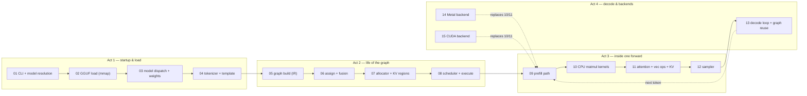

# minfer Inference E2E Walkthrough — one run, stage by stage

This series follows **one real inference run** through the minfer engine, from
the moment you type a prompt to the moment generated text streams out — one
document per pipeline stage, each with the actual code, the data shapes at that
point, and the reasoning behind every design choice.

> **Who this is for.** You can read Rust, but you have never built an LLM
> inference engine. Every concept (token, embedding, KV cache, attention,
> quantization, sampling) is defined where it first appears. If you want the
> compressed version first, read [`docs/ARCHITECTURE.md`](../ARCHITECTURE.md);
> this series is the long version.

> **Version skew.** Line numbers were verified against commit `e7fa0da`
> (2026-09-11). Functions move; the file + function name is the stable address,
> the line number is a convenience.

## The run in one paragraph

You type `./target/release/minfer model.gguf "Hello"`. minfer resolves the
model name to a GGUF file, memory-maps it, and parses its metadata and
quantized weight tensors (01–02). Metadata dispatches the file to a model
implementation (Qwen2/Qwen3) whose weights register into the compute-graph
allocator and, when eligible, into the GPU backend (03). Your prompt is
rendered through the model's chat template and tokenized into integer ids
(04). For those ids the engine **builds a declarative compute graph** — a pure
data structure describing every math op of the transformer — assigns each node
to a backend, fuses op patterns, and allocates buffers by liveness with
persistent per-layer KV regions (05–08). The prefill forward executes the
graph once over all prompt tokens (09): quantized matmuls on CPU (10), RoPE /
RMSNorm / GQA attention over the fresh KV (11), producing the **last-token
logits** — a score per vocabulary entry. The sampler turns those scores into
one next token (12). From then on the decode loop repeats with a single token
per step, reusing the cached graph and the KV accumulated so far (13). On
macOS the same graph runs on Metal (14); with `--features cuda` it runs on
NVIDIA GPUs with int8 MMQ prefill and CUDA Graph replay (15).

## Master table — stage → document → code

| Stage | Doc | Entry code (verified `e7fa0da`) | What happens |
|---|---|---|---|
| CLI parse + model resolution | [01](01-cli-args-model-resolution.md) | `main.rs` (`main`, subcommand dispatch, `GenParams`), `download/mod.rs::resolve` | Flags → defaults; local path / `hf:` / `ollama:` / cached name → a GGUF path; mode branches (`--cnv`, `serve`, `viz`) |
| GGUF load | [02](02-gguf-load.md) | `gguf.rs::load_gguf_model`, `MmapFile` | Parse GGUF v3 (header, metadata KV, tensor table), mmap the data blob zero-copy, merge multi-part splits |
| Model dispatch + weights | [03](03-model-dispatch-weights.md) | `models/mod.rs::load_model`, `models/qwen2/loader.rs`, `MpsState::init` / `CudaState::init_with_gpu`, `GraphAllocator::register_weight` | `general.architecture` → `ModelDef`; hparams + weight tensors; GPU init; weights registered by name into allocator/backend registries |
| Tokenizer + template | [04](04-tokenizer-template.md) | `tokenizer.rs::Tokenizer::load/encode`, `template.rs::render_template` | BPE from GGUF metadata; chat template via minijinja (ChatML fallback); text → token ids |
| Graph build | [05](05-graph-builder-ir.md) | `graph/mod.rs` (IR), `graph/builder.rs`, `models/qwen2/graph.rs::build` | Pure-IR `ComputeGraph`: one node per math op, per-layer topology, decode fusions, `n_out` tail rows; topology = f(`GraphParams`) |
| Assign + fusion | [06](06-assign-fusion.md) | `graph/scheduler.rs::assign_backends`, `graph/fusion.rs::run` | Every node → the best backend whose `supports_op` says yes (Metal → CUDA → CPU); `Mul∘Silu→SwiGLU`, `RoPE∘Add→FusedBiasRope` rewrites |
| Allocate | [07](07-allocator-liveness-kv.md) | `graph/alloc.rs`, `graph/cache.rs` | Liveness-based buffer sharing, in-place aliasing, `fill_input_i32`, two persistent KV regions per layer; `GraphCache` owns it all so KV survives rebuilds |
| Execute | [08](08-scheduler-execute.md) | `graph/scheduler.rs::split_graph/execute` | Contiguous same-backend splits; cross-backend copies at boundaries; execution in build order; one Metal command buffer per split; CUDA replay hook |
| Prefill forward | [09](09-prefill-forward-path.md) | `main.rs` (prefill block), `models/mod.rs::forward` → `forward_graph_cached` | All prompt tokens through the graph; positions drive KV writes and causal masking; last-token logits out; timing calibers |
| CPU matmul kernels | [10](10-cpu-matmul-kernels.md) | `kernel.rs`, `quants.rs`, `block.rs` | Quantized weight × on-the-fly Q8_0 activations; AVX2 / NEON+SDOT dots; persistent thread pool; `repr(C)` block layouts |
| Attention + vec ops + KV | [11](11-attention-vecops-kv.md) | `vec_ops.rs`, `graph/cpu_backend.rs` | RMSNorm, RoPE (two styles), softmax, SiLU; GQA attention; `kvcache_store/load` — positions are data, not structure |
| Sampler | [12](12-sampler.md) | `sampler.rs::sample_with_penalties` | Penalties (repeat/frequency/presence, last-64 window) → top-k → top-p → temperature → seeded sample; stop-string byte matching |
| Decode loop + reuse | [13](13-decode-loop-graph-reuse.md) | `main.rs` (decode loop), `graph/cache.rs::try_reuse`, `conversation.rs` | One token per step: only input *data* changes; first decode step rebuilds the graph, KV survives; multi-turn append-only prefill |
| Metal backend | [14](14-metal-backend.md) | `metal.rs` (`MpsState`), `graph/metal_backend.rs`, `metal.metal` | Same graph on Apple GPU: zero-copy weight buffers, per-op shaders, one command buffer per split, fused decode kernels, flash attention |
| CUDA backend | [15](15-cuda-backend.md) | `graph/cuda_backend.rs`, `cuda.rs`, `cuda_kernels.cu` | Same graph on NVIDIA: resident weights, int8 MMQ prefill / MMVQ decode, split-KV attention, CUDA Graph capture/replay, pinned async staging |

## Reading orders

- **Timeline (default)**: 01 → 15 in order; dashed arrows in the diagram show
  where 14/15 swap in for the CPU kernels and where 13 loops back to 09.
- **"I only care about the graph"**: 05 → 06 → 07 → 08 → 13.
- **"I only care about GPU"**: 08 (splits) → 14 → 15, with
  `docs/CUDA_OPTIMIZATION.md` + `docs/cuda_optimization_steps/` for the kernel
  campaign history and `docs/METAL_OPTIMIZATIONS.md` for Metal's.
- **"What does X mean?"**: every doc's §2 defines its terms; the
  [GLOSSARY](../GLOSSARY.md) is the backstop.

## Conventions

- Docs follow [`STYLE.md`](STYLE.md) (structure, voice, forensics protocol).
- Cross-refs use repo-relative links; env-var behavior is stated where it
  matters and collected per doc in §4 (Observe & verify).
- The series mirrors `docs/cuda_optimization_steps/` in form: numbered
  standalone docs + this index + the shared writing contract.

← Start · [01 — CLI args and model resolution](01-cli-args-model-resolution.md) →
